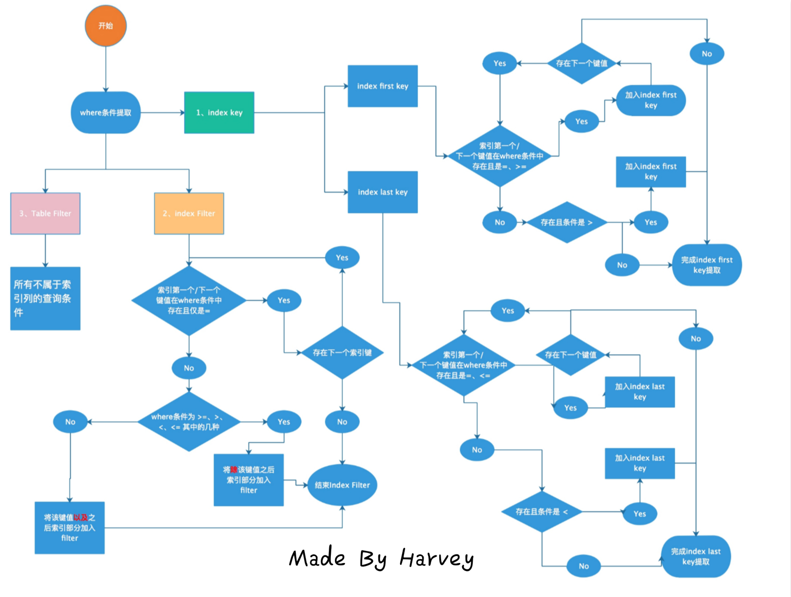

# 10分钟让你明白MySQL是如何利用索引的

 Posted on [2017-07-11][0] by [Harvey][1]  [Leave a comment][2]  [MySQL][3]

## 一、前言

在MySQL中进行SQL优化的时候，经常会在一些情况下，对MySQL能否利用索引有一些迷惑。

譬如:

1. MySQL 在遇到范围查询条件的时候就停止匹配了，那么到底是哪些范围条件？
1. MySQL 在LIKE进行模糊匹配的时候又是如何利用索引的呢？
1. MySQL 到底在怎么样的情况下能够利用索引进行排序？

今天，我将会用一个模型，把这些问题都一一解答，让你对MySQL索引的使用不再畏惧

- - -

## 二、知识补充

### key_len

EXPLAIN执行计划中有一列 key_len 用于表示本次查询中，所选择的索引长度有多少字节，通常我们可借此判断联合索引有多少列被选择了。

在这里 key_len 大小的计算规则是：

* 一般地，key_len 等于索引列类型字节长度，例如int类型为4 bytes，bigint为8 bytes；
* 如果是字符串类型，还需要同时考虑字符集因素，例如：CHAR(30) UTF8则key_len至少是90 bytes；
* 若该列类型定义时允许NULL，其key_len还需要再加 1 bytes；
* 若该列类型为变长类型，例如 VARCHAR（TEXT\BLOB不允许整列创建索引，如果创建部分索引也被视为动态列类型），其key_len还需要再加 2 bytes;

## 三、哪些条件能用到索引

首先非常感谢登博，给了我一个很好的启发，我通过 _**[他的文章][4]**_ ，然后结合自己的理解，制作出了这幅图

[](./img/MySQL-where条件剖析.jpg)

乍一看，是不是很晕，不急，我们慢慢来看

图中一共分了三个部分：

1. Index Key ：MySQL是用来确定扫描的数据范围，实际就是可以利用到的MySQL索引部分，体现在Key Length。
1. Index Filter：MySQL用来确定哪些数据是可以用索引去过滤，在启用ICP后，可以用上索引的部分。
1. Table Filter：MySQL无法用索引过滤，回表取回行数据后，到server层进行数据过滤。

我们细细展开。

### Index Key

Index Key是用来确定MySQL的一个扫描范围，分为上边界和下边界。

MySQL利用=、>=、> 来确定下边界（first key），利用最左原则，首先判断第一个索引键值在where条件中是否存在，如果存在，则判断比较符号，如果为(=,>=)中的一种，加入下边界的界定，然后继续判断下一个索引键，如果存在且是(>)，则将该键值加入到下边界的界定，停止匹配下一个索引键；如果不存在，直接停止下边界匹配。

_exp:  
idx_c1_c2_c3(c1,c2,c3)  
where c1>=1 and c2>2 and c3=1  
--> first key (c1,c2)  
--> c1为 '>=' ，加入下边界界定，继续匹配下一个  
-->c2 为 '>'，加入下边界界定，停止匹配_

上边界（last key）和下边界（first key）类似，首先判断是否是否是(=,<=)中的一种，如果是，加入界定，继续下一个索引键值匹配，如果是(<)，加入界定，停止匹配

_exp:  
idx_c1_c2_c3(c1,c2,c3)  
where c1<=1 and c2=2 and c3<3  
--> first key (c1,c2,c3)  
--> c1为 '<='，加入上边界界定，继续匹配下一个  
--> c2为 '='加入上边界界定，继续匹配下一个  
--> c3 为 '<'，加入上边界界定，停止匹配_

> 注：这里简单的记忆是，如果比较符号中包含'='号，'>='也是包含'='，那么该索引键是可以被利用的，可以继续匹配后面的索引键值；如果不存在'='，也就是'>','<'，这两个，后面的索引键值就无法匹配了。同时，上下边界是不可以混用的，哪个边界能利用索引的的键值多，就是最终能够利用索引键值的个数。

### Index Filter

字面理解就是可以用索引去过滤。也就是字段在索引键值中，但是无法用去确定Index Key的部分。

_exp:  
idex_c1_c2_c3  
where c1>=1 and c2<=2 and c3 =1  
index key --> c1  
index filter--> c2 c3_

这里为什么index filter 只是c1呢？因为c2 是用来确定上边界的，但是上边界的c1没有出现(<=,=)，而下边界中，c1是>=,c2没有出现，因此index key 只有c1字段。c2,c3 都出现在索引中，被当做index filter.

### Table Filter

无法利用索引完成过滤，就只能用table filter。此时引擎层会将行数据返回到server层，然后server层进行table filter。

- - -

## 四、Between 和Like 的处理

那么如果查询中存在between 和like，MySQL是如何进行处理的呢？

### Between

`where c1 between 'a' and 'b'` 等价于 `where c1>='a' and c1 <='b'`，所以进行相应的替换，然后带入上层模型，确定上下边界即可

### Like

首先需要确认的是%不能是最在最左侧，`where c1 like '%a'` 这样的查询是无法利用索引的，因为索引的匹配需要符合最左前缀原则

`where c1 like 'a%'` 其实等价于` where c1>='a' and c1<'b'` 大家可以仔细思考下。

- - -

## 五、索引的排序

在数据库中，如果无法利用索引完成排序，随着过滤数据的数据量的上升，排序的成本会越来越大，即使是采用了limit，但是数据库是会选择将结果集进行全部排序，再取排序后的limit 记录，而且MySQL 针对可以用索引完成排序的limit 有优化，更能减少成本。

 > Make sure it uses index It is very important to have ORDER BY with LIMIT executed without scanning and sorting full result set, so it is important for it to use index – in this case index range scan will be started and query **execution stopped as soon as soon as required amount of rows generated.**

```sql
    CREATE TABLE `t1` (
      `id` int(11) NOT NULL AUTO_INCREMENT,
      `c1` int(11) NOT NULL DEFAULT '0',
      `c2` int(11) NOT NULL DEFAULT '0',
      `c3` int(11) NOT NULL DEFAULT '0',
      `c4` int(11) NOT NULL DEFAULT '0',
      `c5` int(11) NOT NULL DEFAULT '0',
      PRIMARY KEY (`id`),
      KEY `idx_c1_c2_c3` (`c1`,`c2`,`c3`)
    ) ENGINE=InnoDB AUTO_INCREMENT=8 DEFAULT CHARSET=utf8mb4
    
     select * from t1;
    +----+----+----+----+----+----+
    | id | c1 | c2 | c3 | c4 | c5 |
    +----+----+----+----+----+----+
    |  1 |  3 |  3 |  2 |  0 |  0 |
    |  2 |  2 |  4 |  5 |  0 |  0 |
    |  3 |  3 |  2 |  4 |  0 |  0 |
    |  4 |  1 |  3 |  2 |  0 |  0 |
    |  5 |  1 |  3 |  3 |  0 |  0 |
    |  6 |  2 |  3 |  5 |  0 |  0 |
    |  7 |  3 |  2 |  6 |  0 |  0 |
    +----+----+----+----+----+----+
    7 rows in set (0.00 sec)
    
     select c1,c2,c3 from t1;
    +----+----+----+
    | c1 | c2 | c3 |
    +----+----+----+
    |  1 |  3 |  2 |
    |  1 |  3 |  3 |
    |  2 |  3 |  5 |
    |  2 |  4 |  5 |
    |  3 |  2 |  4 |
    |  3 |  2 |  6 |
    |  3 |  3 |  2 |
    +----+----+----+
    7 rows in set (0.00 sec)
```

存在一张表，c1,c2,c3上面有索引，`select c1,c2,c3 from t1;` 查询走的是索引全扫描，因此呈现的数据相当于在没有索引的情况下`select c1,c2,c3 from t1 order by c1,c2,c3;` 的结果  
因此，索引的有序性规则是怎么样的呢？

_c1=3 —> c2 有序，c3 无序_  
_c1=3,c2=2 — > c3 有序_  
_c1 in(1,2) —> c2 无序 ，c3 无序_

> 有个小规律，idx_c1_c2_c3，那么如何确定某个字段是有序的呢？c1 在索引的最前面，肯定是有序的，c2在第二个位置，只有在c1 唯一确定一个值的时候，c2才是有序的，如果c1有多个值，那么c2 将不一定有序，同理，c3也是类似

- - -

## 六、小结

针对MySQL索引，我这边只是提到了在单表查询情况下的模型，通过这篇文章，想必大家应该了解到MySQL大部分情况下是如何利用索引的，如果存在疑问，欢迎联系我

[0]: http://fordba.com/spend-10-min-to-understand-how-mysql-use-index.html
[1]: http://fordba.com/author/admin
[2]: http://fordba.com/spend-10-min-to-understand-how-mysql-use-index.html#respond
[3]: http://fordba.com/category/mysql
[4]: http://hedengcheng.com/?p=577