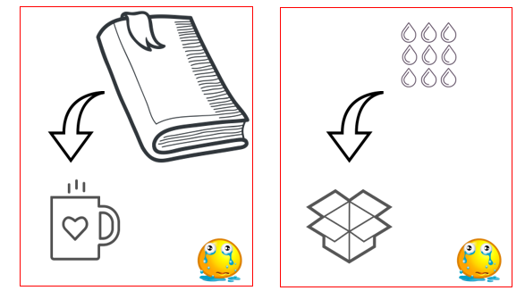
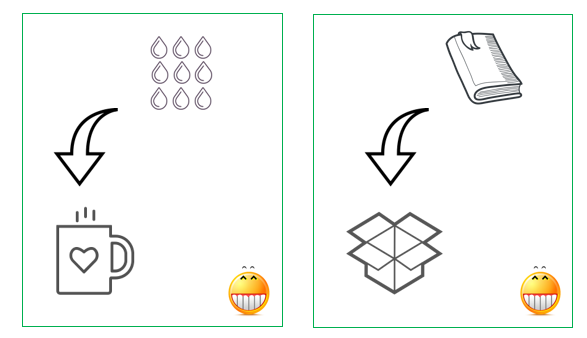
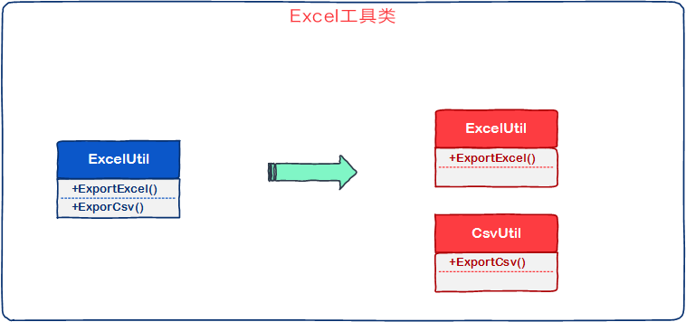
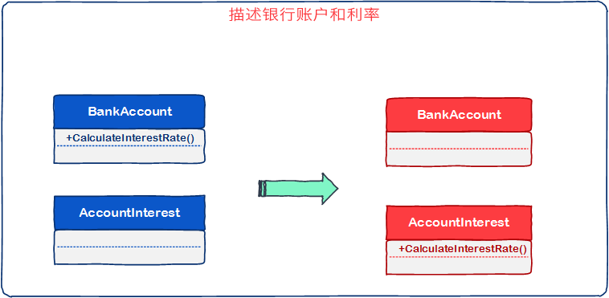

# [小酌重构系列[1]——移动方法][0]

### 概要

有些开发者在编写方法时，可能较少地去思考一个问题：方法放在这个class中是否合适？

他们可能会觉得：这个方法已经实现xxx功能了，放在哪个class都一样的，class不就是一个装方法的容器嘛。

我赞同class是一个装东西的容器，且不仅限于方法。

但是，容器是有区别的。本文要讲的“移动方法”，是一种让方法放进合适的class的重构策略。

### 选择合适的容器

生活中我们会用到杯子和箱子，杯子和箱子都是容器。  
倘若你用杯子装书，用箱子装水，会产生不好的结果——杯子里放不下书，水装进箱子后，会打湿箱子。

隐藏代码

    // 杯子
    public class Cup
    {
        // 装书
        public void HoldBook()
        {
    
        }
    }
    
    // 箱子
    public class Box
    {
        // 装水
        public void HoldWater()
        {
    
        }
    }
    

  
按照生活常识，我们应该用杯子装水，用箱子装书。

隐藏代码

    // 杯子
    public class Cup
    {
        // 装水
        public void HoldWater()
        {
    
        }
    }
    
    // 箱子
    public class Box
    {
        // 装书
        public void HoldBook()
        {
    
        }
    }
    

每个程序员在开发完功能后，都应该回头读一读自己的代码，确认是否存在一些“牛头不对马嘴”的方法。  
class是方法的容器，我们应该为每个方法寻找最合适的容器。

### 移动方法

现在引入本文的主题：“移动方法”。

当某个类的方法实现的功能更多地适用于另外一个类，且符合它的语义时，应将该方法移动到另外一个类。

该定义中有两个关键词： 1. 适用 2. 语义。

“适用性”是指方法实现的功能应该适用它的class，“语义”是指方法的所描述的功能和class的语义是一致的。  
“语义”的重要性高于“适用性”，例如：在程序中定义的扩展方法或者帮助类，通常都是被其它class调用的。这种情况下，我们应该着重体现“语义”。

有些开发者在编写Excel工具类时，在ExcelUtil中出定义了ExportCsv()这样的方法，尽管导出的Csv格式是可以用Excel打开的。  
较好的做法是，新建一个CsvUtil类，将ExportCsv()方法定义在其中，下图阐述了这个重构过程（蓝色表示重构前，红色表示重构后）。  
虽然多了一个class，但这使得Excel工具类和Csv工具类的语义更佳精确，代码的可读性也提高了。

### 示例

这段代码定义了两个类：BankAccount、AccountInterest，分别表示银行账户和账户利率。  
计算利率的方法CalculateInterestRate()定义在BankAccount类。

隐藏代码

    namespace MoveMethod.Before
    {
        /// 

        /// 银行账户
        /// 

        public class BankAccount
        {
            public BankAccount(int accountAge, int creditScore, AccountInterest accountInterest)
            {
                AccountAge = accountAge;
                CreditScore = creditScore;
                AccountInterest = accountInterest;
            }
    
            public int AccountAge { get; private set; }
            public int CreditScore { get; private set; }
            public AccountInterest AccountInterest { get; private set; }
    
            // 计算利率
            public double CalculateInterestRate()
            {
                if (CreditScore > 800)
                    return 0.02;
    
                if (AccountAge > 10)
                    return 0.03;
    
                return 0.05;
            }
        }
    
        /// 

        /// 账户利率
        /// 

        public class AccountInterest
        {
            public BankAccount Account { get; private set; }
    
            public AccountInterest(BankAccount account)
            {
                Account = account;
            }
    
            public double InterestRate
            {
                get { return Account.CalculateInterestRate(); }
            }
    
            public bool IntroductoryRate
            {
                get { return Account.CalculateInterestRate() < 0.05; }
            }
        }
    }
    

这两个class用于描述一件客观事实——”银行账户和计算账户利率的方式“。  
咋一看，这两个类没有什么问题。  
但由于已经定义了AccountInterest类，这个class的语义是和利率相关的，而CalculateInterestRate()方法用于计算账户利率。  
所以将CalculateInterestRate()方法放在BankAccount类中不太合适，应将其移动到AccountInterest类中。

隐藏代码

    namespace MoveMethod.After
    {
        /// 

        /// 银行账户
        /// 

        public class BankAccount
        {
            public BankAccount(int accountAge, int creditScore, AccountInterest accountInterest)
            {
                AccountAge = accountAge;
                CreditScore = creditScore;
                AccountInterest = accountInterest;
            }
    
            public int AccountAge { get; private set; }
            public int CreditScore { get; private set; }
            public AccountInterest AccountInterest { get; private set; }
        }
    
        /// 

        /// 账户利率
        /// 

        public class AccountInterest
        {
            public BankAccount Account { get; private set; }
    
            public AccountInterest(BankAccount account)
            {
                Account = account;
            }
    
            public double InterestRate
            {
                get { return CalculateInterestRate(); }
            }
    
            public bool IntroductoryRate
            {
                get { return CalculateInterestRate() < 0.05; }
            }
    
            /// 

            /// 计算利率
            /// 

            public double CalculateInterestRate()
            {
                if (Account.CreditScore > 800)
                    return 0.02;
    
                if (Account.AccountAge > 10)
                    return 0.03;
    
                return 0.05;
            }
        }
    }
    

下图描述了重构前后的区别（蓝色表示重构前，红色表示重构后）。

### 总结

移动方法是较简单的一种重构策略，它旨在将方法移动到合适的类。  
这个策略的关键在于找到方法体现的行为（功能），以及该行为对应的语义。  
找到语义，我们就能将它放到合适的类。  
其中的难点也在于语义，语义应该具备“准确性”。  
有时候业务知识、对现实物体（对象）的理解可能会阻碍我们寻找到准确的语义。

[0]: http://www.cnblogs.com/keepfool/p/5427750.html