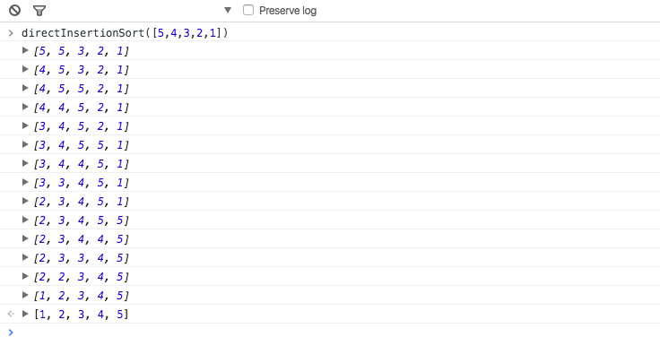
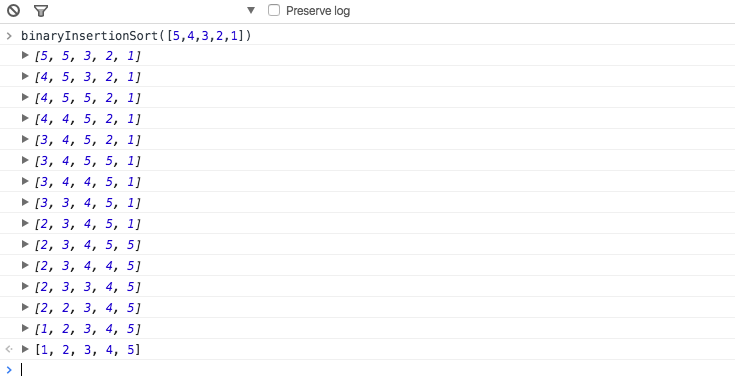
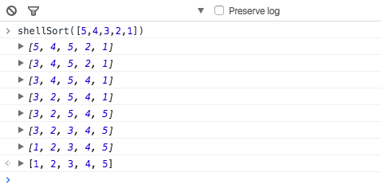
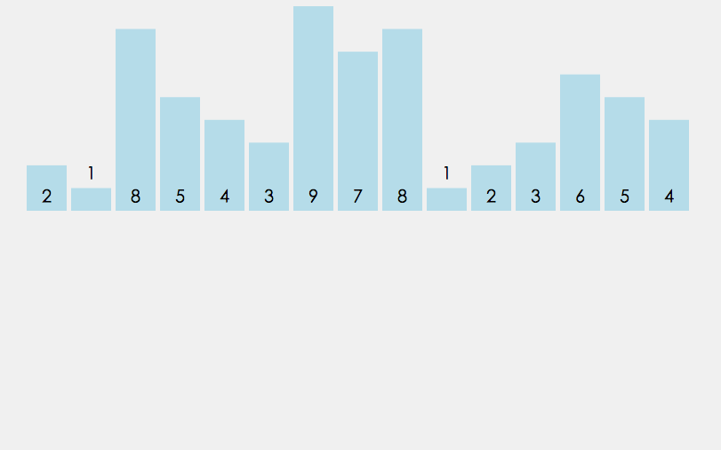
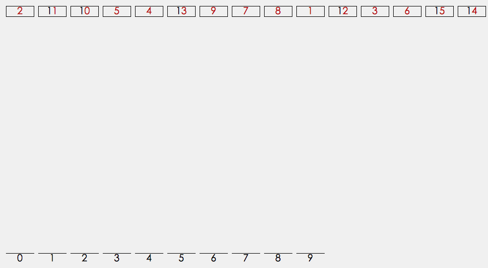

# JS中可能用得到的全部的排序算法 

* [JavaScript][0]

目录

1. [导读][1]
1. [冒泡排序][2]
1. [双向冒泡排序][3]
1. [选择排序][4]
1. [插入排序][5]
    1. [直接插入排序][6]
    1. [折半插入排序][7]
    1. [希尔排序][8]

1. [归并排序][9]
1. [快速排序][10]
1. [堆排序][11]
1. [计数排序][12]
1. [桶排序][13]
1. [基数排序][14]
1. [小结][15]

### 导读

排序算法可以称得上是我的盲点, 曾几何时当我知道Chrome的Array.prototype.sort使用了快速排序时, 我的内心是奔溃的(啥是快排, 我只知道冒泡啊?!), 要知道学习一门技术最好的时间是三年前, 但愿我现在补习还来得及(捂脸).

因此本篇重拾了出镜概率比较高的十来种排序算法, 逐一分析其排序思想, 并批注注意事项. 欢迎对算法提出改进和[讨论][16].

### 冒泡排序

[](./img/sort02.gif "水泡")

冒泡排序需要两个嵌套的循环. 其中, 外层循环移动游标; 内层循环遍历游标及之后(或之前)的元素, 通过两两交换的方式, 每次只确保该内循环结束位置排序正确, 然后内层循环周期结束, 交由外层循环往后(或前)移动游标, 随即开始下一轮内层循环, 以此类推, 直至循环结束.

**_Tips_**: 由于冒泡排序只在相邻元素大小不符合要求时才调换他们的位置, 它并不改变相同元素之间的相对顺序, 因此它是稳定的排序算法.

由于有两层循环, 因此可以有四种实现方式.

方案 | 外层循环 | 内层循环 
-|-|-
1 | 正序 | 正序 
2 | 正序 | 逆序 
3 | 逆序 | 正序 
4 | 逆序 | 逆序 

四种不同循环方向, 实现方式略有差异.

如下是动图效果(对应于方案1: 内/外层循环均是正序遍历.

[](./img/sort05.gif "冒泡排序")

如下是上图的算法实现(对应**方案一**: 内/外层循环均是正序遍历).
```js
//先将交换元素部分抽象出来

function swap(i,j,array){

  var temp = array[j];

  array[j] = array[i];

  array[i] = temp;

}
```
    

```js
function bubbleSort(array) {

  var length = array.length, isSwap;

  for (var i = 0; i < length; i++) {            //正序

    isSwap = false;

    for (var j = 0; j < length - 1 - i; j++) {   //正序

      array[j] > array[j+1] && (isSwap = true) && swap(j,j+1,array);

    }

    if(!isSwap)

      break;

  }

  return array;

}
```
以上, 排序的特点就是: 靠后的元素位置先确定.

**方案二**: 外循环正序遍历, 内循环逆序遍历, 代码如下:

    

```js
function bubbleSort(array) {

  var length = array.length, isSwap;

  for (var i = 0; i < length; i++) {            //正序

    isSwap = false;

    for (var j = length - 1; j >= i+1; j--) {    //逆序

      array[j] < array[j-1] && (isSwap = true) && swap(j,j-1,array);

    }

    if(!isSwap)

      break;

  }

  return array;

}
```
以上, 靠前的元素位置先确定.

**方案三**: 外循环逆序遍历, 内循环正序遍历, 代码如下:

    

```js
function bubbleSort(array) {

  var length = array.length, isSwap;

  for (var i = length - 1; i >= 0; i--) {    //逆序

    isSwap = false;

    for (var j = 0; j < i; j++) {           //正序

      array[j] > array[j+1] && (isSwap = true) && swap(j,j+1,array);

    }

    if(!isSwap)

      break;

  }

  return array;

}
```
以上, 由于内循环是正序遍历, 因此靠后的元素位置先确定.

**方案四**: 外循环逆序遍历, 内循环逆序遍历, 代码如下:
```js
function bubbleSort(array) {

  var length = array.length, isSwap;

  for (var i = length - 1; i >= 0; i--) {               //逆序

    isSwap = false;

    for (var j = length - 1; j >= length - 1 - i; j--) { //逆序

      array[j] < array[j-1] && (isSwap = true) && swap(j,j-1,array);

    }

    if(!isSwap)

      break;

  }

  return array;

}
```
以上, 由于内循环是逆序遍历, 因此靠前的元素位置先确定.

以下是其算法复杂度:

平均时间复杂度 | 最好情况 | 最坏情况 | 空间复杂度 
-|-|-|-
O(n²) | O(n) | O(n²) | O(1) 

冒泡排序是最容易实现的排序, 最坏的情况是每次都需要交换, 共需遍历并交换将近n²/2次, 时间复杂度为O(n²). 最佳的情况是内循环遍历一次后发现排序是对的, 因此退出循环, 时间复杂度为O(n). 平均来讲, 时间复杂度为O(n²). 由于冒泡排序中只有缓存的temp变量需要内存空间, 因此空间复杂度为常量O(1).

### 双向冒泡排序

双向冒泡排序是冒泡排序的一个简易升级版, 又称鸡尾酒排序. 冒泡排序是从低到高(或者从高到低)单向排序, 双向冒泡排序顾名思义就是从两个方向分别排序(通常, 先从低到高, 然后从高到低). 因此它比冒泡排序性能稍好一些.

如下是算法实现:
```js

function bothwayBubbleSort(array){

  var tail = array.length-1, i, isSwap = false;

  for(i = 0; i < tail; tail--){

    for(var j = tail; j > i; j--){  //第一轮, 先将最小的数据冒泡到前面

      array[j-1] > array[j] && (isSwap = true) && swap(j,j-1,array);

    }

    i++;

    for(j = i; j < tail; j++){      //第二轮, 将最大的数据冒泡到后面

      array[j] > array[j+1] && (isSwap = true) && swap(j,j+1,array);

    }

  }

  return array;

}
```
### 选择排序

从算法逻辑上看, 选择排序是一种简单且直观的排序算法. 它也是两层循环. 内层循环就像工人一样, 它是真正做事情的, 内层循环每执行一遍, 将选出本次待排序的元素中最小(或最大)的一个, 存放在数组的起始位置. 而 外层循环则像老板一样, 它告诉内层循环你需要不停的工作, 直到工作完成(也就是全部的元素排序完成).

**_Tips_**: 选择排序每次交换的元素都有可能不是相邻的, 因此它有可能打破原来值为相同的元素之间的顺序. 比如数组[2,2,1,3], 正向排序时, 第一个数字2将与数字1交换, 那么两个数字2之间的顺序将和原来的顺序不一致, **虽然它们的值相同, 但它们相对的顺序却发生了变化**. 我们将这种现象称作 不稳定性 .

如下是动图效果:

[](./img/sort06.gif "选择排序")

如下是上图的算法实现:
```js
function selectSort(array) {

  var length = array.length, min;

  for (var i = 0; i < length - 1; i++) {

    min = i;

    for (var j = i + 1; j < length; j++) {

      array[j] < array[min] && (min = j); //记住最小数的下标

    }

    min!=i && swap(i,min,array);

  }

  return array;

}
```
以下是其算法复杂度:

平均时间复杂度 最好情况 最坏情况 空间复杂度 O(n²) O(n²) O(n²) O(1) 

选择排序的简单和直观名副其实, 这也造就了它”出了名的慢性子”, 无论是哪种情况, 哪怕原数组已排序完成, 它也将花费将近n²/2次遍历来确认一遍. 即便是这样, 它的排序结果也还是不稳定的. 唯一值得高兴的是, 它并不耗费额外的内存空间.

### 插入排序

插入排序的设计初衷是往有序的数组中快速插入一个新的元素. 它的算法思想是: 把要排序的数组分为了两个部分, 一部分是数组的全部元素(除去待插入的元素), 另一部分是待插入的元素; 先将第一部分排序完成, 然后再插入这个元素. 其中第一部分的排序也是通过再次拆分为两部分来进行的.

插入排序由于操作不尽相同, 可分为 直接插入排序 , 折半插入排序(又称二分插入排序), 链表插入排序 , 希尔排序 .

#### 直接插入排序

它的基本思想是: 将待排序的元素按照大小顺序, 依次插入到一个已经排好序的数组之中, 直到所有的元素都插入进去.

如下是动图效果:

[](./img/sort07.gif "直接插入排序")

如下是上图的算法实现:
```js
function directInsertionSort(array) {

  var length = array.length, index, current;

  for (var i = 1; i < length; i++) {

    index = i - 1;       //待比较元素的下标

    current = array[i];  //当前元素

    while(index >= 0 && array[index] > current) { //前置条件之一:待比较元素比当前元素大

      array[index+1] = array[index];    //将待比较元素后移一位

      index--;                         //游标前移一位

      //console.log(array);

    }

    if(index+1 != i){                  //避免同一个元素赋值给自身

      array[index+1] = current;         //将当前元素插入预留空位

      //console.log(array);

    }       

  }

  return array;

}
```
为了更好的观察到直接插入排序的实现过程, 我们不妨将上述代码中的注释部分加入. 以数组 [5,4,3,2,1] 为例, 如下便是原数组的演化过程.

[](./img/sort01.png "")

可见, 数组的各个元素, 从后往前, 只要比前面的元素小, 都依次插入到了合理的位置.

**_Tips_**: 由于直接插入排序每次只移动一个元素的位置, 并不会改变值相同的元素之间的排序, 因此它是一种稳定排序.

#### 折半插入排序

折半插入排序是直接插入排序的升级版. 鉴于插入排序第一部分为已排好序的数组, 我们不必按顺序依次寻找插入点, 只需比较它们的中间值与待插入元素的大小即可.

**_Tips_**: 同直接插入排序类似, 折半插入排序每次交换的是相邻的且值为不同的元素, 它并不会改变值相同的元素之间的顺序. 因此它是稳定的.

算法基本思想是: 

1. 取0 ~ i-1的中间点( m = (i-1)>>1 ), array[i] 与 array[m] 进行比较, 若array[i] < array[m] , 则说明待插入的元素array[i] 应该处于数组的 0 ~ m 索引之间; 反之, 则说明它应该处于数组的 m ~ i-1 索引之间.
1. 重复步骤1, 每次缩小一半的查找范围, 直至找到插入的位置.
1. 将数组中插入位置之后的元素全部后移一位.
1. 在指定位置插入第 i 个元素.

> 注: x>>1 是位运算中的右移运算, 表示右移一位, 等同于x除以2再取整, 即 x>>1 == Math.floor(x/2) .

如下是算法实现:
```js
function binaryInsertionSort(array){

  var current, i, j, low, high, m;

  for(i = 1; i < array.length; i++){

    low = 0;

    high = i - 1;

    current = array[i];

    while(low <= high){         //步骤1&2:折半查找

      m = (low + high)>>1;

      if(array[i] >= array[m]){//值相同时, 切换到高半区，保证稳定性

        low = m + 1;        //插入点在高半区

      }else{

        high = m - 1;       //插入点在低半区

      }

    }

    for(j = i; j > low; j--){    //步骤3:插入位置之后的元素全部后移一位

      array[j] = array[j-1];

    }

    array[low] = current;        //步骤4:插入该元素

  }

  return array;

}
```
为了便于对比, 同样以数组 [5,4,3,2,1] 举例🌰. 原数组的演化过程如下(与上述一样):

[](./img/sort.png "折半插入排序")

虽然折半插入排序明显减少了查询的次数, 但是数组元素移动的次数却没有改变. 它们的时间复杂度都是O(n²).

#### 希尔排序

希尔排序也称缩小增量排序, 它是直接插入排序的另外一个升级版, 实质就是分组插入排序. 希尔排序以其设计者希尔(Donald Shell)的名字命名, 并于1959年公布.

算法的基本思想: 

1. 将数组拆分为若干个子分组, 每个分组由相距一定”增量”的元素组成. 比方说将[0,1,2,3,4,5,6,7,8,9,10]的数组拆分为”增量”为5的分组, 那么子分组分别为 [0,5], [1,6], [2,7], [3,8], [4,9] 和 [5,10].
1. 然后对每个子分组应用直接插入排序.
1. 逐步减小”增量”, 重复步骤1,2.
1. 直至”增量”为1, 这是最后一个排序, 此时的排序, 也就是对全数组进行直接插入排序.

如下是排序的示意图:

[](./img/sort04.png "希尔排序示意图")

可见, 希尔排序实际上就是不断的进行直接插入排序, 分组是为了先将局部元素有序化. 因为直接插入排序在元素基本有序的状态下, 效率非常高. 而希尔排序呢, 通过先分组后排序的方式, 制造了直接插入排序高效运行的场景. 因此希尔排序效率更高.

我们试着抽象出共同点, 便不难发现上述希尔排序的第四步就是一次直接插入排序, 而希尔排序原本就是从”增量”为n开始, 直至”增量”为1, 循环应用直接插入排序的一种封装. 因此直接插入排序就可以看做是步长为1的希尔排序. 为此我们先来封装下直接插入排序.
```js
//形参增加步数gap(实际上就相当于gap替换了原来的数字1)

function directInsertionSort(array, gap) {

  gap = (gap == undefined) ? 1 : gap;       //默认从下标为1的元素开始遍历

  var length = array.length, index, current;

  for (var i = gap; i < length; i++) {

    index = i - gap;    //待比较元素的下标

    current = array[i]; //当前元素

    while(index >= 0 && array[index] > current) { //前置条件之一:待比较元素比当前元素大

      array[index + gap] = array[index];    //将待比较元素后移gap位

      index -= gap;                        //游标前移gap位

    }

    if(index + gap != i){                  //避免同一个元素赋值给自身

      array[index + gap] = current;         //将当前元素插入预留空位

    }

  }

  return array;

}
```
那么希尔排序的算法实现如下:
```js
function shellSort(array){

  var length = array.length, gap = length>>1, current, i, j;

  while(gap > 0){

    directInsertionSort(array, gap); //按指定步长进行直接插入排序

    gap = gap>>1;

  }

  return array;

}
```
同样以数组[5,4,3,2,1] 举例🌰. 原数组的演化过程如下:

[](./img/sort03.png "希尔排序")

对比上述直接插入排序和折半插入排序, 数组元素的移动次数由14次减少为7次. 通过拆分原数组为粒度更小的子数组, 希尔排序进一步提高了排序的效率.

不仅如此, 以上步长设置为了 {N/2, (N/2)/2, …, 1}. 该序列即[希尔增量][17], 其它的增量序列 还有Hibbard：{1, 3, …, 2^k-1}. 通过合理调节步长, 还能进一步提升排序效率. 实际上已知的最好步长序列是由Sedgewick提出的(1, 5, 19, 41, 109,…). 该序列中的项或者是9*4^i - 9*2^i + 1或者是4^i - 3*2^i + 1. 具体请戳 [希尔排序-维基百科][18] .

**_Tips_**: 我们知道, 单次直接插入排序是稳定的, 它不会改变相同元素之间的相对顺序, 但在多次不同的插入排序过程中, 相同的元素可能在各自的插入排序中移动, 可能导致相同元素相对顺序发生变化. 因此, 希尔排序并不稳定.

### 归并排序

归并排序建立在归并操作之上, 它采取分而治之的思想, 将数组拆分为两个子数组, 分别排序, 最后才将两个子数组合并; 拆分的两个子数组, 再继续递归拆分为更小的子数组, 进而分别排序, 直到数组长度为1, 直接返回该数组为止.

**_Tips_**: 归并排序严格按照从左往右(或从右往左)的顺序去合并子数组, 它并不会改变相同元素之间的相对顺序, 因此它也是一种稳定的排序算法.

如下是动图效果:

[](./img/sort08.gif "归并排序")

归并排序可通过两种方式实现:

1. 自上而下的递归
1. 自下而上的迭代

如下是算法实现(方式1:递归):
```js
function mergeSort(array) {  //采用自上而下的递归方法

  var length = array.length;

  if(length < 2) {

    return array;

  }

  var m = (length >> 1),

      left = array.slice(0, m),

      right = array.slice(m); //拆分为两个子数组

  return merge(mergeSort(left), mergeSort(right));//子数组继续递归拆分,然后再合并

}

function merge(left, right){ //合并两个子数组

  var result = [];

  while (left.length && right.length) {

    var item = left[0] <= right[0] ? left.shift() : right.shift();//注意:判断的条件是小于或等于,如果只是小于,那么排序将不稳定.

    result.push(item);

  }

  return result.concat(left.length ? left : right);

}
```
由上, 长度为n的数组, 最终会调用mergeSort函数2n-1次. 通过自上而下的递归实现的归并排序, 将存在堆栈溢出的风险. 亲测各浏览器的堆栈溢出所需的递归调用次数大致为:

* Chrome v55: 15670
* Firefox v50: 44488
* Safari v9.1.2: 50755

以下是测试代码:
```js

function computeMaxCallStackSize() {

  try {

    return 1 + computeMaxCallStackSize();

  } catch (e) {

    // Call stack overflow

    return 1;

  }

}

var time = computeMaxCallStackSize();

console.log(time);
```
为此, ES6规范中提出了尾调优化的思想: 如果一个函数的最后一步也是一个函数调用, 那么该函数所需要的栈空间将被释放, 它将直接进入到下次调用中, 最终调用栈里只保留最后一次的调用记录.

虽然ES6规范如此诱人, 然而目前并没有浏览器支持尾调优化, 相信在不久的将来, 尾调优化就会得到主流浏览器的支持.

以下是其算法复杂度:

平均时间复杂度 最好情况 最坏情况 空间复杂度 O(nlog₂n) O(nlog₂n) O(nlog₂n) O(n) 

从效率上看, 归并排序可算是排序算法中的”佼佼者”. 假设数组长度为n, 那么拆分数组共需logn步, 又每步都是一个普通的合并子数组的过程, 时间复杂度为O(n), 故其综合时间复杂度为| O(nlogn) |. 另一方面, 归并排序多次递归过程中拆分的子数组需要保存在内存空间, 其空间复杂度为O(n).

### 快速排序

快速排序借用了分治的思想, 并且基于冒泡排序做了改进. 它由C. A. R. Hoare在1962年提出. 它将数组拆分为两个子数组, 其中一个子数组的所有元素都比另一个子数组的元素小, 然后对这两个子数组再重复进行上述操作, 直到数组不可拆分, 排序完成.

如下是动图效果:

[](./img/sort09.gif "快速排序")

如下是算法实现:
```js
function quickSort(array, left, right) {

  var partitionIndex,

      left = typeof left == 'number' ? left : 0,

      right = typeof right == 'number' ? right : array.length-1;

  if (left < right) {

    partitionIndex = partition(array, left, right);//切分的基准值

    quickSort(array, left, partitionIndex-1);

    quickSort(array, partitionIndex+1, right);

  }

  return array;

}

function partition(array, left ,right) {   //分区操作

  for (var i = left+1, j = left; i <= right; i++) {//j是较小值存储位置的游标

    array[i] < array[left] && swap(i, ++j, array);//以第一个元素为基准

  }

  swap(left, j, array);         //将第一个元素移至中间

  return j;

}
```
以下是其算法复杂度:

平均时间复杂度 最好情况 最坏情况 空间复杂度 O(nlog₂n) O(nlog₂n) O(n²) O(nlog₂n) 

快速排序排序效率非常高. 虽然它运行最糟糕时将达到O(n²)的时间复杂度, 但通常, 平均来看, 它的时间复杂为O(nlogn), 比同样为O(nlogn)时间复杂度的归并排序还要快. 快速排序似乎更偏爱乱序的数列, 越是乱序的数列, 它相比其他排序而言, 相对效率更高. 之前在 [捋一捋JS的数组][19] 一文中就提到: **Chrome的v8引擎为了高效排序, 在排序数据超过了10条时, 便会采用快速排序. 对于10条及以下的数据采用的便是插入排序.**

**_Tips_**: 同选择排序相似, 快速排序每次交换的元素都有可能不是相邻的, 因此它有可能打破原来值为相同的元素之间的顺序. 因此, 快速排序并不稳定.

### 堆排序

> 1991年的计算机先驱奖获得者、斯坦福大学计算机科学系教授罗伯特·弗洛伊德(Robert W．Floyd) 和威廉姆斯(J．Williams) 在1964年共同发明了著名的堆排序算法(Heap Sort).

堆排序是利用堆这种数据结构所设计的一种排序算法. 它是选择排序的一种. 堆分为大根堆和小根堆. 大根堆要求每个子节点的值都不大于其父节点的值, 即array[childIndex] <= array[parentIndex], 最大的值一定在堆顶. 小根堆与之相反, 即每个子节点的值都不小于其父节点的值, 最小的值一定在堆顶. 因此我们可使用大根堆进行升序排序, 使用小根堆进行降序排序.

并非所有的序列都是堆, 对于序列k1, k2,…kn, 需要满足如下条件才行:

* ki <= k(2i) 且 ki<=k(2i+1)(1≤i≤ n/2), 即为小根堆, 将<=换成>=, 那么则是大根堆. 我们可以将这里的堆看作完全二叉树, k(i) 相当于是二叉树的非叶子节点, k(2i) 则是左子节点, k(2i+1)是右子节点.

算法的基本思想(以大根堆为例): 

1. 先将初始序列K[1..n]建成一个大根堆, 此堆为初始的无序区.
1. 再将关键字最大的记录K[1][16] (即堆顶)和无序区的最后一个记录K[n]交换, 由此得到新的无序区K[1..n-1]和有序区K[n], 且满足K[1..n-1].keys≤K[n].key
1. 交换K[1][16] 和 K[n] 后, 堆顶可能违反堆性质, 因此需将K[1..n-1]调整为堆. 然后重复步骤2, 直到无序区只有一个元素时停止.

如下是动图效果:

[](./img/1867034-bf2472770e2258a9.gif "桶排序示意图")

如下是算法实现:
```js
function heapAdjust(array, i, length) {//堆调整

  var left = 2 * i + 1,

      right = 2 * i + 2,

      largest = i;

  if (left < length && array[largest] < array[left]) {

    largest = left;

  }

  if (right < length && array[largest] < array[right]) {

    largest = right;

  }

  if (largest != i) {

    swap(i, largest, array);

    heapAdjust(array, largest, length);

  }

}

function heapSort(array) {

  //建立大顶堆

  length = array.length;

  for (var i = length>>1; i >= 0; i--) {

    heapAdjust(array, i, length);

  }

  //调换第一个与最后一个元素,重新调整为大顶堆

  for (var i = length - 1; i > 0; i--) {

    swap(0, i, array);

    heapAdjust(array, 0, --length);

  }

  return array;

}
```
以上, ①建立堆的过程, 从length/2 一直处理到0, 时间复杂度为O(n);

②调整堆的过程是沿着堆的父子节点进行调整, 执行次数为堆的深度, 时间复杂度为O(lgn);

③堆排序的过程由n次第②步完成, 时间复杂度为O(nlgn).

**_Tips_**: 由于堆排序中初始化堆的过程比较次数较多, 因此它不太适用于小序列. 同时由于多次任意下标相互交换位置, 相同元素之间原本相对的顺序被破坏了, 因此, 它是不稳定的排序.

### 计数排序

计数排序几乎是唯一一个不基于比较的排序算法, 该算法于1954年由 Harold H. Seward 提出. 使用它处理一定范围内的整数排序时, 时间复杂度为O(n+k), 其中k是整数的范围, 它几乎比任何基于比较的排序算法都要快( 只有当O(k)>O(n*log(n))的时候其效率反而不如基于比较的排序, 如归并排序和堆排序).

使用计数排序需要满足如下条件:

* 待排序的序列全部为整数
* 排序需要额外的存储空间

算法的基本思想: 

> 计数排序利用了一个特性, 对于数组的某个元素, 一旦知道了有多少个其它元素比它小(假设为m个), 那么就可以确定出该元素的正确位置(第m+1位)

1. 初始化游标i为0, 并准备一个缓存数组B, 长度为待排序数组A的最大值+1, 循环一遍待排序数组A, 在缓存数组B中存储A的各个元素出现的次数.
1. ①将B中的当前元素item与0比较, 若大于0, 则往待排序数组A中写入一项A[i] = item; 然后i++, item—; 然后重复步骤①, 直到item==0, 则进入到B的下一个元素中.
1. 遍历缓存数组B, 即循环执行步骤2. 最终所有有效元素都将依次写回待排序数组A的第1,2,…n项.

如下是动图效果:

[](./img/sort10.gif "计数排序")

如下是算法实现:
```js
function countSort(array, max) {

    var tempLength = max + 1,

        temp = new Array(tempLength),

        index = 0,

        length = array.length;   

    //初始化缓存数组各项的值

    for (var i = 0; i < length; i++) {

        if (!temp[array[i]]) {

            temp[array[i]] = 0;

        }

        temp[array[i]]++;

    }

    //依次取出缓存数组的值,并写入原数组

    for (var j = 0; j < tempLength; j++) {

        while(temp[j] > 0) {

            array[index++] = j;

            temp[j]--;

        }

    }

    return array;

}
```
**_Tips_**: 计数排序不改变相同元素之间原本相对的顺序, 因此它是稳定的排序算法.

### 桶排序

桶排序即所谓的箱排序, 它是将数组分配到有限数量的桶子里. 每个桶里再各自排序(因此有可能使用别的排序算法或以递归方式继续桶排序). 当每个桶里的元素个数趋于一致时, 桶排序只需花费O(n)的时间. 桶排序通过空间换时间的方式提高了效率, 因此它需要额外的存储空间(即桶的空间).

算法的基本思想:

桶排序的核心就在于怎么把元素平均分配到每个桶里, 合理的分配将大大提高排序的效率.

如下是算法实现:
```js
function bucketSort(array, bucketSize) {

  if (array.length === 0) {

    return array;

  }

  var i = 1,

      min = array[0],

      max = min;

  while (i++ < array.length) {

    if (array[i] < min) {

      min = array[i];                //输入数据的最小值

    } else if (array[i] > max) {

      max = array[i];                //输入数据的最大值

    }

  }

  //桶的初始化

  bucketSize = bucketSize || 5; //设置桶的默认大小为5

  var bucketCount = ~~((max - min) / bucketSize) + 1, //桶的个数

      buckets = new Array(bucketCount); //创建桶

  for (i = 0; i < buckets.length; i++) {

    buckets[i] = []; //初始化桶

  }

  //将数据分配到各个桶中,这里直接按照数据值的分布来分配,一定范围内均匀分布的数据效率最为高效

  for (i = 0; i < array.length; i++) {

    buckets[~~((array[i] - min) / bucketSize)].push(array[i]);

  }

  array.length = 0;

  for (i = 0; i < buckets.length; i++) {

    quickSort(buckets[i]); //对每个桶进行排序，这里使用了快速排序

    for (var j = 0; j < buckets[i].length; j++) {

      array.push(buckets[i][j]); //将已排序的数据写回数组中

    }

  }

  return array;

}
```
**_Tips_**: 桶排序本身是稳定的排序, 因此它的稳定性与桶内排序的稳定性保持一致.

实际上, 桶也只是一个抽象的概念, 它的思想与归并排序,快速排序等类似, 都是通过将大量数据分配到N个不同的容器中, 分别排序, 最后再合并数据. 这种方式大大减少了排序时整体的遍历次数, 提高了算法效率.

### 基数排序

基数排序源于老式穿孔机, 排序器每次只能看到一个列. 它是基于元素值的每个位上的字符来排序的. 对于数字而言就是分别基于个位, 十位, 百位 或千位等等数字来排序. (不明白不要紧, 我也不懂, 请接着往下读)

按照优先从高位或低位来排序有两种实现方案:

* MSD: 由高位为基底, 先按k1排序分组, 同一组中记录, 关键码k1相等, 再对各组按k2排序分成子组, 之后, 对后面的关键码继续这样的排序分组, 直到按最次位关键码kd对各子组排序后. 再将各组连接起来, 便得到一个有序序列. MSD方式适用于位数多的序列.
* LSD: 由低位为基底, 先从kd开始排序，再对kd-1进行排序，依次重复，直到对k1排序后便得到一个有序序列. LSD方式适用于位数少的序列.

如下是LSD的动图效果:

[](./img/sort11.gif "基数排序"))

如下是算法实现:
```js
function radixSort(array, max) {

    var buckets = [],

        unit = 10,

        base = 1;

    for (var i = 0; i < max; i++, base *= 10, unit *= 10) {

        for(var j = 0; j < array.length; j++) {

            var index = ~~((array[j] % unit) / base);//依次过滤出个位,十位等等数字

            if(buckets[index] == null) {

                buckets[index] = []; //初始化桶

            }

            buckets[index].push(array[j]);//往不同桶里添加数据

        }

        var pos = 0,

            value;

        for(var j = 0, length = buckets.length; j < length; j++) {

            if(buckets[j] != null) {

                while ((value = buckets[j].shift()) != null) {

                      array[pos++] = value; //将不同桶里数据挨个捞出来,为下一轮高位排序做准备,由于靠近桶底的元素排名靠前,因此从桶底先捞

                }

            }

        }

    }

    return array;

}
```
以上算法, 如果用来比较时间, 先按日排序, 再按月排序, 最后按年排序, 仅需排序三次.

基数排序更适合用于对时间, 字符串等这些整体权值未知的数据进行排序.

**_Tips_**: 基数排序不改变相同元素之间的相对顺序, 因此它是稳定的排序算法.

### 小结

各种排序性能对比如下:

排序类型 | 平均情况 | 最好情况 | 最坏情况 | 辅助空间 | 稳定性 
-|-|-|-|-|-
冒泡排序 | O(n²) | O(n) | O(n²) | O(1) | 稳定 
选择排序 | O(n²) | O(n²) | O(n²) | O(1) | 不稳定 
直接插入排序 | O(n²) | O(n) | O(n²) | O(1) | 稳定 
折半插入排序 | O(n²) | O(n) | O(n²) | O(1) | 稳定 
希尔排序 | O(n^1.3) | O(nlogn) | O(n²) | O(1) | 不稳定 
归并排序 | O(nlog₂n) | O(nlog₂n) | O(nlog₂n) | O(n) | 稳定 
快速排序 | O(nlog₂n) | O(nlog₂n) | O(n²) | O(nlog₂n) | 不稳定 
堆排序 | O(nlog₂n) | O(nlog₂n) | O(nlog₂n) | O(1) | 不稳定 
计数排序 | O(n+k) | O(n+k) | O(n+k) | O(k) | 稳定 
桶排序 | O(n+k) | O(n+k) | O(n²) | O(n+k) | (不)稳定 
基数排序 | O(d(n+k)) | O(d(n+k)) | O(d(n+kd)) | O(n+kd) | 稳定 

注: 桶排序的稳定性取决于桶内排序的稳定性, 因此其稳定性不确定. 基数排序中, k代表关键字的基数, d代表长度, n代表关键字的个数.

愿以此文怀念下我那远去的算法课程.

未完待续…

感谢 [http://visualgo.net/][20] 提供图片支持. 特别感谢 [不是小羊的肖恩][21] 在简书上发布的 [JS家的排序算法][22] 提供的讲解.

- - -

本问就讨论这么多内容,大家有什么问题或好的想法欢迎在下方参与[留言和评论][16].

本文作者: [louis][23]

本文链接: [http://louiszhai.github.io/2016/12/23/sort/][24]

参考文章

* [JS家的排序算法 - 简书][22]
* [白话经典算法系列之三 希尔排序的实现 - MoreWindows Blog - 博客频道 - CSDN.NET][25]
* [算法与数据结构(十三) 冒泡排序、插入排序、希尔排序、选择排序（Swift3.0版） - 青玉伏案 - 博客园][26]

[0]: http://louiszhai.github.io/tags/JavaScript/
[1]: #导读
[2]: #冒泡排序
[3]: #双向冒泡排序
[4]: #选择排序
[5]: #插入排序
[6]: #直接插入排序
[7]: #折半插入排序
[8]: #希尔排序
[9]: #归并排序
[10]: #快速排序
[11]: #堆排序
[12]: #计数排序
[13]: #桶排序
[14]: #基数排序
[15]: #小结
[16]: #respond
[17]: http://baike.baidu.com/view/10729635.htm
[18]: https://zh.wikipedia.org/wiki/%E5%B8%8C%E5%B0%94%E6%8E%92%E5%BA%8F#步长序列
[19]: http://louiszhai.github.io/2015/12/29/array/#
[20]: http://visualgo.net/
[21]: http://www.jianshu.com/users/6c53fb7d1bce
[22]: http://www.jianshu.com/p/1b4068ccd505
[23]: https://github.com/Louiszhai
[24]: http://louiszhai.github.io/2016/12/23/sort/
[25]: http://blog.csdn.net/morewindows/article/details/6668714
[26]: http://www.cnblogs.com/ludashi/p/6031379.html