# [PHP_底层分析][0]

* [php][1]
[**Alogy**][2] 2016年08月26日发布 

* 推荐 **3** 推荐
* 收藏 **14** 收藏，**774** 浏览

# PHP编译特点

**编译型语言**

对于C语言，C++，编译成机器码(二进制)来运行。  
Java语言，把.java 编译成.class， 称为bytecode(字节码)，由jvm来运行

**解释型语言**

解释器解释执行。 典型的如： linux shell

解释器逐行来执行命令

**PHP执行**

PHP是先编译后执行

PHP稍有特殊，虽然是一个脚本语言，但不是靠解释器解释。而是zend虚拟机执行，屏蔽了操作系统的区别。

PHP代码编译成 opcode，由zend虚拟机来执行opcode。

但是opcode ,PHP脚本一结束，opcode就清除了。

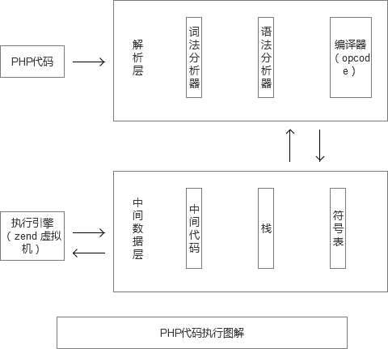

> opcode 能否缓存

PHP本身不支持，但是apc，xcache等加速器，实现了这样的效果。

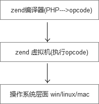

# 变量的底层实现

PHP底层是C语言来实现的，C语言是强类型，而PHP是弱类型语言，是如何实现的

PHP的源码包：

    |__ ext
    |__ main
    |__ pear
    |__ sapi
    |__ tests
    |__ TSRM
    |__ Zend
    |__ .gdbinit
    

最核心的是Zend,这是zend虚拟的实现。包括栈，数据类型，编译器等.  
最重要的main，PHP的一些内建函数，最重要的函数都在该目录下.  
最大的一个目录 ext， PHP的扩展.

PHP的大部分功能，都是以extenstion形式来完成的。  
如果自身开发了一个扩展，也放入ext目录下。

弱类型语言变量的实现

    /* zend.h  */
    struct _zval_struct {
        zvalue_value value;  /* 值 */
        zend_uint refcount__gc;
        zend_uchar type; /* 活动类型 */
        zend_uchar is_ref__gc;    
    }
    

PHP中的一个变量，zend虚拟机中，使用的是 _zval_struct 的结构体来描述，变量的值也是一个就结构体来描述.

_zval_struct的结构体是由 四个字段/域 (可以理解成关联数组)

zvalue_value value; /* 值 */PHP变量的值，存储这个字段中。

具体存储的位置：

    /* value 值 是一个 联合 */
    /* zend.h */
    typedef union _zval_value {
        long lval; /* long value */
        double dval; /* double value */
        struct {
            char * val;
            int len;
        } str;
        HashTable *ht; /* hash table 指针 */
        zend_object_value obj;
    } zvalue_value;
    

> Zend对变量的表示

zend实现了 zval结构体

    {
        value: [联合体] /* 联合体的内容可能是C语言中的long,double,hashtable(*ht),obj, 联合体只能是其中一种类型，是一个枚举 */
        type: 变量类型 , /* IS_NULL,IS_BOOL,IS_STRING, IS_LONG,IS_DOUBLE,IS_ARRAY,IS_OBJECT,IS_RESOURCE */
        refcount_gc
        is_ref_gc 
    }
    

C语言中类型对应PHP中的数据类型：

    long -> int
    double -> double
    hashtable -> array
    struct -> string
    obj -> object
    

例如：

    $a = 3;
    {
        value: [long lval = 3]
        type: IS_LONG
    }
    
    
    $a = 3.5;
    {
        value: [double dval = 3.5]
        type: IS_DOUBLE
    }
    

# 变量类型的实现

zend_uchar type; /* 活动类型 */可以根据上下文环境来强制转换。  
例如：需要echo 的时候 就转换成 string  
需要加减运算就 转换成 int

PHP 中有8中数据类型，为什么zval->value 联合体中，只有5中 ?  
1: NULL，直接 zval->type = IS_NULL, 就可以表示，不必设置 value 的值。  
2：BOOL， zval->type = IS_BOOL. 再设置 zval.value.lval = 1/0; (C语言中没有布尔值，都是通过1，0，来表示)  
3: resource ，资源型，往往是服务器上打开一个接口，如果 文件读取接口。 zval->type = IS_RESOURCE, zval->type.lval = 服务器上打开的接口编号。

    struct {
        char * val;
        int len;
    } str;
    

PHP中，字符串类型，长度是已经缓存的，调用strlen时，系统可以直接返回其长度，不需要计算。

    $b = 'hello';
    
    /**
     * 
     * {
     *     union_zvalue {
     *      // 字符串的指针
     *         struct{
     *             char: 'hello';
     *             len: 5 
     *         } str;
     *     }
     *     type: IS_STRING;
     *  refcount_gc: 1,
     *  is_ref_gc: 0 
     * }
     * 
     */
     
    //在PHP中字符串的长度，是直接体现在其结构体中,所以调用strlen(); 速度非常快，时间复杂度为0(1)
    
    echo strlen($b);
    
    

# 符号表

符号表symbol_table，变量的花名册

符号表是什么?

符号表示一张哈希表(哈希结构理解成关联数组)  
里面存储了变量名-> 变量zval结构体的地址

    struct _zend_executor_globals {
        ...
        ...
        HashTable * active_symbol_table /* 活动符号表 */
        HashTable symbol_table /* 全局符号表 */
        HashTable included_files; /* files already included */
    }
    

- - -

    // 变量花名册
    $a = 3;
    $b = 1.223;
    $c = 'hello';
    
    /**
     * 
     * 生成了3个结构体
     * 同时，全局符号表，中多了三条记录
     * 
     * a ---> 0x123 ---> 结构体 { 3 }
     * b ---> 0x21a ---> 结构体 { 1.223 }
     * c ---> 0x1A0 ---> 结构体 { hello }
     *
     */
     
     // 变量声明 
     // 第一：结构体生成
     // 第二：符号表中多了记录，变量的花名册
     // 第三：指向结构体 
    

# 传值赋值

传值赋值发生了什么

在传值赋值时：  
以：$a = 3; $b = $a;为例：  
并没有再次产生结构体，而是2个变量共用1个结构体  
此时，2个变量，指向同1个结构体  
refcount_gc 值为 2 (如果没有指针指引，会有垃圾回收机制清除)

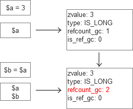

# 写时复制

cow写时复制特性

    $a = 3;
    $b = $a;
    
    /**
     * 
     * 是否产生了2 个结构体?
     * 不是，共用1个， refcount_gc = 2;
     *  
     */
    
    $b = 5;
    
    echo $a, $b; // 3, 5
    // $a,$b 指向同一个结构体，那么，修改$b或$a，对方会不会受干扰 ? 没有干扰到对方。具有写时复制的特性 
    

如果有一方修改，将会造成结构体的分裂

结构体一开始共用，到某一方要修改值时，才分裂。这种特性称为：COW 。Copy On Write。

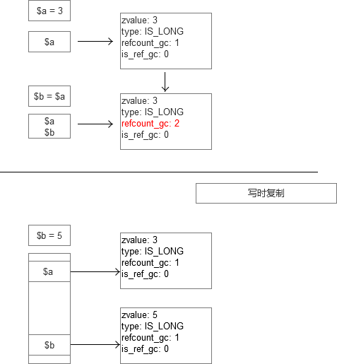

# 引用赋值

引用赋值发生了什么

当引用赋值时，双方共用一个结构体(is_ref_gc=1)

关系图例展示：

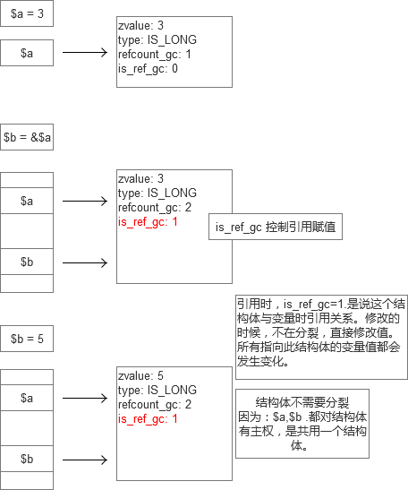

# 强制分裂

    <?php
    
    // 强制分裂
    
    $a = 3;
    /**
     * {
     *         value: 3;
     *         type: IS_LONG;
     *       refcount_gc: 1;
     *         is_ref_gc: 0;
     * }
     */
    $b = $a;
    /**
     * {
     *         value: 3;
     *    type: IS_LONG;
     *    refcount_gc: 2;
     *    is_ref_gc: 0;
     * }
     */
    $c = &$a;
    // 不会按照 底下结构体变化
    /**
     *    {
     *         value: 3;
     *    type: IS_LONG;
     *    refcount_gc: 3;  
     *    is_ref_gc: 1; 
     * } 
     */    
    
    // 正确的结构体变化
    // 如果is_ref_gc  0->1 的过程中(从0到1,表示想引用变量)。refcount_gc>1。多个变量共享一个变量值。将会产生强制分裂
    /**
     * // $a $c 结构体 
     *    {
     *    value: 3;
     *    type: IS_LONG;
     *    refcount_gc: 2;  
     *    is_ref_gc: 1; 
     * } 
     * 
     * // $b 结构体
     * {
     *    value: 3;
     *    type: IS_LONG;
     *    refcount_gc: 1;  
     *    is_ref_gc: 0; 
     * }
     *  
     */      
    
    $c = 5;
    // a c
    /**
     * value: 5
     * type: IS_LONG; 
     * refcount_gc: 2;
     * is_ref_gc: 1;
     */
     
     // b
    /**
     * value: 3
     * type: IS_LONG;
     * refcount_gc: 1;
     * is_ref_gc: 0;
     */    
    
    echo $a, $b, $c; // 5 , 3 , 5 
    
    

引用数组时的一些奇怪现象

    // 引用数组时的怪现象
        
    $arr = array(0, 1, 2, 3);
    
    $tmp = $arr;
    
    $arr[1] = 11;
    
    echo $arr[1]; // 1
    
    // 数组不会比较细致的检查，多维数组存在。 因此，判断的时候，只会判断外面 一层的 结构体。
    

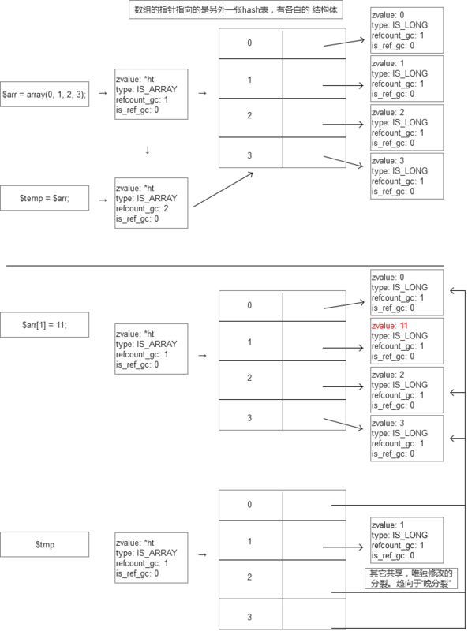

数组不会比较细致的检查

    // 先 引用 后 赋值
    $arr = array(0, 1, 2, 3);
    
    $x = &$arr[1];
    
    $tmp = $arr;
    
    $arr[1] = 999;
    
    echo $tmp[1]; // 999 . hash表中的zvalue结构体中会变成引用类型。  // 只去关注外面一层结构体，而不去关注 hash表中的值。
    
    
    echo ' ';
    
    // 先赋值，后引用
    $arr = array(0, 1, 2, 3);
    
    $tmp = $arr;
    
    $x = &$arr[1];
    
    $arr[1] = 999;
    
    echo $tmp[1]; // 1     
    

# 循环数组

循环数组时的怪现象

    // 循环数组时的怪现象
    $arr = array(0, 1, 2, 3);
    
    foreach ( $arr as $v ) {
        
    }
    
    var_dump(current($arr));  // 数组指针停留在数组结尾处， 取不到值. false
    
    echo ' ';
    
    $arr = array(0, 1, 2, 3);
    
    foreach ( $arr as $val=>$key ) { // foreach 使用的 $arr 是   $arr的副本.
        $arr[$key] = $val;  // 修改之后，就会产生分裂。 foreach 遍历的是 $arr 的副本。 但是原数组的指针已经走了一步. 
    } 
    
    var_dump(current($arr)); // 1
    
    

- - -

    
    $arr = array('a', 'b', 'c', 'd');
    
    foreach ( $arr as &$val ) {  // 该foreach 会导致 $val = &$arr[3];
        
    }
    
    foreach ( $arr as $val ) {
        print_r($arr);
        echo ' ';
    }
    // 两个问题： 
    // 数组使用时，要慎用引用。
    // foreach 使用后，不会把数组的内部指针重置, 使用数组时，不要假想内部指针指向数组头部. 也可以在foreach 之后 reset(); 指针。
    

# 符号表与作用域

当执行到函数时，会生成函数的“执行环境结构体”，包含函数名，参数，执行步骤，所在的类（如果是方法），以及为这个函数生成一个符号表。  
符号表统一放在栈上，并把active_symbol_table指向刚产生的符号表。

    // Zend/zend_compiles.h 文件中
    
    // 源码：
    struct _zend_execute_data {
        struct _zend_op *opline;
        zend_function_state function_state;
        zend_op_array *op_array;
        zval *object;
        HashTable *symbol_table;
        struct _zend_execute_data *prev_execute_data;
        zval *old_error_reporting;
        zend_bool nested;
        zval **original_return_value;
        zend_class_entry *current_scope;
        zend_class_entry *current_called_scope;
        zval *current_this;
        struct _zend_op *fast_ret; /* used by FAST_CALL/FAST_RET (finally keyword) */
        zval *delayed_exception;
        call_slot *call_slots;
        call_slot *call;
    };
    

- - -

    // 简化：
    
    struct _zend_execute_data {
        ...
        zend_op_array *op_array;     // 函数的执行步骤. 如果是函数调用。是函数调用的后的opcode
        HashTable *symbol_table; // 此函数的符号表地址
        zend_class_entry *current_scope; // 执行当前作用域
        zval * current_this;  // 对象 调用 this绑定 
        zval * current_object;  // object 的指向
        ...
    }
    

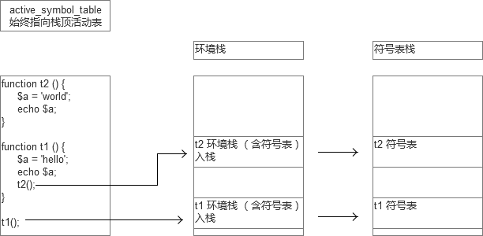

一个函数调用多次，会有多少个*op_array ?  
**一个函数产生 一个*op_array**. 调用多次，会产生多个 环境结构体， 会依次入栈，然后顺序执行。  
调用多少次，就会入栈多少次。不同的执行环境，靠 唯一的 *op_array 来执行。

函数什么时候调用， 函数编译后的 opcode 什么时候执行。

    $age = 23;
    
    function t() {
        $age = 3;
        echo $age;
    }
    
    t();
    
    /**
     * t 函数 在执行时，根据函数的参数，局部变量等，生成一个执行环境结构体。
     * 结构体 入栈，函数编译后的 opcode， 称为 op_array （就是执行逻辑）。开始执行， 以入栈的环境结构体为环境来执行。
     * 并生成此函数的 符号表， 函数寻找变量， 就在符号表中寻找。即局部变量。(一个环境结构体，就对应一张符号表)
     * 
     * 
     * 注意： 函数可能调用多次。栈中可能有某函数的多个执行环境 入栈。但是 op_array 只有一个。
     * 
     */
    

# 静态变量

静态变量的实现

    // Zend/zend_compile.h  
    struct _zend_op_array {
        /* Common elements */
        zend_uchar type;
        const char *function_name;
        zend_class_entry *scope;
        zend_uint fn_flags;
        union _zend_function *prototype;
        zend_uint num_args;
        zend_uint required_num_args;
        zend_arg_info *arg_info;
        /* END of common elements */
    
        zend_uint *refcount;
    
        zend_op *opcodes;
        zend_uint last;
    
        zend_compiled_variable *vars;
        int last_var;
    
        zend_uint T;
    
        zend_uint nested_calls;
        zend_uint used_stack;
    
        zend_brk_cont_element *brk_cont_array;
        int last_brk_cont;
    
        zend_try_catch_element *try_catch_array;
        int last_try_catch;
        zend_bool has_finally_block;
    
        /* static variables support */
        HashTable *static_variables;
    
        zend_uint this_var;
    
        const char *filename;
        zend_uint line_start;
        zend_uint line_end;
        const char *doc_comment;
        zend_uint doc_comment_len;
        zend_uint early_binding; /* the linked list of delayed declarations */
    
        zend_literal *literals;
        int last_literal;
    
        void **run_time_cache;
        int  last_cache_slot;
    
        void *reserved[ZEND_MAX_RESERVED_RESOURCES];
    };
    

- - -

    // 简化
    struct _zend_op_array {
        ... 
        HashTable *static_variables;    // 静态变量
        ...
    }
    

编译后的 op_array 只有一份。 静态变量并没有存储在符号表(symbol_table)中.而是存放在op_array中。

    function t() {
        
        static $age = 1;
        
        return $age += 1;
        
    }
    
    echo t();
    echo t();
    echo t();
    
    // 静态变量 不再和 执行的结构体， 也不再和 入栈的符号表有关。
    
    

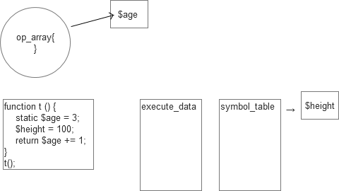

# 常量

    
    // Zend/zend_constants.h
    // 常量结构体 
    typedef struct _zend_constant {
        zval value; // 变量结构体
        int flags; // 标志，是否大小写敏感等
        char *name; // 常量名
        uint name_len; // 
        int module_number; // 模块名
    } zend_constant;
    

## define函数的实现

define函数当然是 调用zend_register_constant声明的常量  
具体如下：Zend/zend_builtin_functions.c

// 源码：

    ZEND_FUNCTION(define)
    {
        char *name;
        int name_len;
        zval *val;
        zval *val_free = NULL;
        zend_bool non_cs = 0;
        int case_sensitive = CONST_CS;
        zend_constant c;
    
        if (zend_parse_parameters(ZEND_NUM_ARGS() TSRMLS_CC, "sz|b", &name, &name_len, &val, &non_cs) == FAILURE) {
            return;
        }
    
        if(non_cs) {
            case_sensitive = 0;
        }
    
        /* class constant, check if there is name and make sure class is valid & exists */
        if (zend_memnstr(name, "::", sizeof("::") - 1, name + name_len)) {
            zend_error(E_WARNING, "Class constants cannot be defined or redefined");
            RETURN_FALSE;
        }
    
    repeat:
        switch (Z_TYPE_P(val)) {
            case IS_LONG:
            case IS_DOUBLE:
            case IS_STRING:
            case IS_BOOL:
            case IS_RESOURCE:
            case IS_NULL:
                break;
            case IS_OBJECT:
                if (!val_free) {
                    if (Z_OBJ_HT_P(val)->get) {
                        val_free = val = Z_OBJ_HT_P(val)->get(val TSRMLS_CC);
                        goto repeat;
                    } else if (Z_OBJ_HT_P(val)->cast_object) {
                        ALLOC_INIT_ZVAL(val_free);
                        if (Z_OBJ_HT_P(val)->cast_object(val, val_free, IS_STRING TSRMLS_CC) == SUCCESS) {
                            val = val_free;
                            break;
                        }
                    }
                }
                /* no break */
            default:
                zend_error(E_WARNING,"Constants may only evaluate to scalar values");
                if (val_free) {
                    zval_ptr_dtor(&val_free);
                }
                RETURN_FALSE;
        }
        
        c.value = *val;
        zval_copy_ctor(&c.value);
        if (val_free) {
            zval_ptr_dtor(&val_free);
        }
        c.flags = case_sensitive; /* non persistent */
        c.name = str_strndup(name, name_len);
        if(c.name == NULL) {
            RETURN_FALSE;
        }
        c.name_len = name_len+1;
        c.module_number = PHP_USER_CONSTANT;
        if (zend_register_constant(&c TSRMLS_CC) == SUCCESS) {
            RETURN_TRUE;
        } else {
            RETURN_FALSE;
        }
    }
    

- - -

    // 关键代码：
    
    c.value = *val;
    zval_copy_ctor(&c.value);
    if (val_free) {
        zval_ptr_dtor(&val_free);
    }
    c.flags = case_sensitive; /* 大小写敏感 */
    c.name = str_strndup(name, name_len);
    if(c.name == NULL) {
        RETURN_FALSE;
    }
    c.name_len = name_len+1;
    c.module_number = PHP_USER_CONSTANT; /* 用户定义常量 */
    if (zend_register_constant(&c TSRMLS_CC) == SUCCESS) {
        RETURN_TRUE;
    } else {
        RETURN_FALSE;
    }
    

常量就一个符号(哈希)表. 都使用一个符号表。所以全局有效。

常量的生成

    int zend_register_constant(zend_constant *c TSRMLS_DC) {
        ...
        ...
        zend_hash_add(EG(zend_constants), name, c->name_len, (vaid*)c,sizeof(zend_constant, NULL) == FAILURE);
        ...
        ...
    }
    

对象定义常量

    
    class Dog {
        
        public $name = 'kitty';
        
        public function __toString () {
            return $this->name;
        }
        
    }
    
    $dog = new Dog();
    
    
    define('DOG', $dog);
    
    print_r(DOG);
    
    /**
     * define 值为对象时，会把对象装成标量来存储，需要类有 __toString魔术方法
     */    
     
    

# 对象

对象的底层实现

Zend/zend.h

    struct _zval_struct {
        /* Variable information */
        zvalue_value value;        /* value */
        zend_uint refcount__gc;
        zend_uchar type;    /* active type */
        zend_uchar is_ref__gc;
    };
    
    // zvalue
    typedef union _zvalue_value {
        long lval;                    /* long value */
        double dval;                /* double value */
        struct {
            char *val;
            int len;
        } str;
        HashTable *ht;                /* hash table value */
        zend_object_value obj;
        zend_ast *ast;
    } zvalue_value;
    
    // 在 zend.h 中 查看到 `zend_object_value obj;`  是以zend_object_value 定义. 在Zend/zend_types.h 文件中继续查看
    
    // Zend/zend_types.h
    

定义zend_object_value 结构体

    typedef struct _zend_object_value {
        zend_object_handle handle;
        const zend_object_handlers *handlers;
    } zend_object_value;
    

通过new出来的对象，返回的是什么。是zend_object_value. 并不是真正的对象，而是对象的指针。

返回的 handle再次指向对象。

每次new一个对象，对象就存入一张hash表中。(形象的称之为对象池)

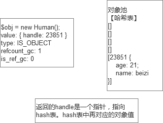

对象存储时的特点：

    // 对象
    
    class Dog {
        public $leg = 4;
        public $wei = 20;
    }
    
    $dog = new Dog();
    
    // $dog 是一个对象么?
    // 严格说，并不是对象.
    /**
     * {
     *     handle --指向-->  [hash表 {leg: 4, wei: 20}] // hash表中存在 对象    
     * }
     */
     
    $d2 = $dog;
    
    $d2->leg = 5;
    
    echo $dog->leg, '`', $d2->leg; // 5`5
    
    // 对象并不是 引用赋值. 主要原因  zval 结构体 是再次指向一个hash表中的 对象池
    $d2 = false;
    
    echo $dog->leg; // 5
        
    

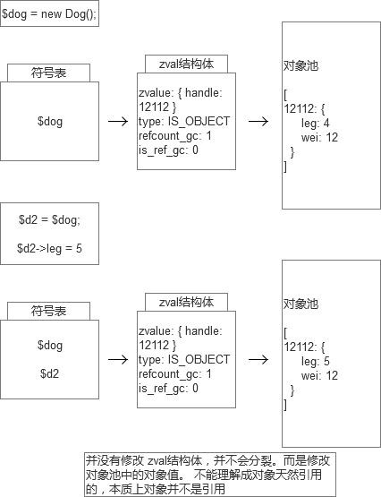

# 内存分层

内存管理与垃圾回收

PHP封装了对系统内存的请求  
不要直接使用malloc直接请求内存

PHP函数需要内存的时候，是通过emalloc,efree.   
emalloc,efree向 mm_heap索要空间。

zend 中底层都离不开hash表。PHP中的HashTable太强大。

PHP 底层 所有的变量都是 放在 zend_mm_heap 中。 然后通过 各自的hash表来指向或跟踪。

> zend虚拟机的运行原理

* PHP语法实现

    Zend/zend_language_scanner.l
    Zend/zend_language_parser.y
* OPcode编译

    Zend/zend.compile.c
* 执行引擎

    Zend/zend_vm_*
    Zend/zend_execute.c

> 以apache模块运行时的流程

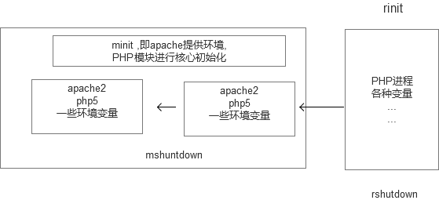

[0]: /a/1190000006725176
[1]: /t/php/blogs
[2]: /u/alogy