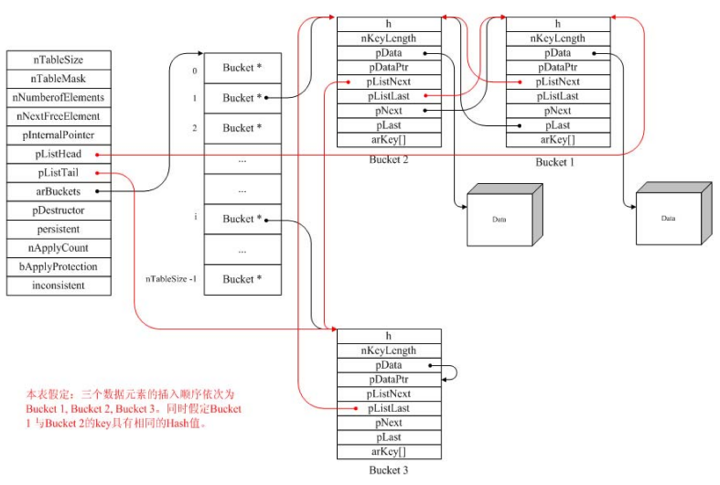

# [php底层HashTable的实现][0]

* [hashtable][1]
* [php][2]

[**阿木**][3] 2014年10月11日发布 

* 推荐 **0** 推荐
* 收藏 **9** 收藏，**2.4k** 浏览

HashTable对PHP来说是一种非常重要的数据结构。很多PHP的内部实现（变量的作用域，函数表，类的属性、方法，数组）就是通过HashTable来实现的。最近了解了一下PHP底层HashTable的实现。  
PHP底层HashTable的实现有两个非常重要的结构分别是:HashTable和Bucket。  
先说一下HashTable结构:  
HashTable的底层实现代码如下:

    typedef struct _hashtable{
        uint nTableSize;         // hash Bucket的大小，最小为8
        uint nTableMask;         //nTableSize - 1, 索引取值的优化
        uint nNumofElements      // bucket 里面存的总数 
        ulong nNextFreeElement   //下一个数字索引的位置
        Bucket *pInternalPointer  //当前遍历的指针(foreach比较快的原因)
        Bucket *pListHead         //整个hashtable的头指针
        Bucket *pListTail         //整个hashTable的尾指针
        Bucket **argBuckets       // Buceket 数组，用来存储数据
        doctor_func_t pDestructor //删除元素时的回调函数，用于资源的释放
        zend_bool persistent      //Bucket的内存分配方式，true使用系统的分配函数，false 使用php的内存分配函数
        unsigned char nApplyCount //标记当前hash bucket 被递归的次数
        zend_bool bApplyProtection 
    #if ZEND_DEBUG
        int inconsistent           
    #endif 
    }HashTable
    

建议不太了解hash数据结构的同学先简单了解一下hash结构。  
简单说一下php中hashtable的初始化操作:  
代码如下：

     ZEND_API int _zend_hash_init(HashTable *ht, uint nSize, hash_func_t pHashFunction, dtor_func_t pDestructor, zend_bool persistent ZEND_FILE_LINE_DC)
    {
        uint i = 3;
        //...
        if (nSize >= 0x80000000) {
            /* prevent overflow */
            ht->nTableSize = 0x80000000;
        } else {
            while ((1U << i) < nSize) {
                i++;
            }
            ht->nTableSize = 1 << i;
        }
        // ...
        ht->nTableMask = ht->nTableSize - 1;
    
        /* Uses ecalloc() so that Bucket* == NULL */
        if (persistent) {
            tmp = (Bucket **) calloc(ht->nTableSize, sizeof(Bucket *));
            if (!tmp) {
                return FAILURE;
            }
            ht->arBuckets = tmp;
        } else {
            tmp = (Bucket **) ecalloc_rel(ht->nTableSize, sizeof(Bucket *));
            if (tmp) {
                ht->arBuckets = tmp;
            }
        }
    
        return SUCCESS;
    }
    

最开始判断需要初始化的hashtable大小是不是超过了系统能使用的最大大小。下面是对tablesize大小的一个处理。将用户自定义的大小改成需要的大小。例如:如果用户定义的hashtable大小是6，那初始化时，就会将6变成8，如果用户定义的大小为11，那初始化后的Hashtable的大小为16.  
下面就是一个简单的判断，来决定是按照C语言本身的分配内存函数来分配内存，还是根据php封装好的内存分配函数来分配内存。

再谈一下 bucket的结构

    typedef struct bucket{
        ulong h;       //对key索引以后的值，数字key不做kash
        uint nKeyLength; //key的长度
        void *pData;     
        void *pDataPtr;   //指针数据，指向真实数据
        struct bucket * pListNext; //整个hash表的下个元素
        struct bucket *pListLast;   //整个hash表的上个元素
        struct bucket *pNext;       //本bucket里面，下一个元素
        struct bucket *pLast;       //本bucket里面的上一个元素
        char arKey[1];
    }Bucket
    

这里用一张网络上的很火的图来说明(图原地址没找到，没有做来源说明):

下面是引用了tipi里面的插入说明:  
引用地址:[tipi][5]

> 如图中左下角的假设，假设依次插入了Bucket1，Bucket2，Bucket3三个元素：

> 1、插入Bucket1时，哈希表为空，经过哈希后定位到索引为1的槽位。此时的1槽位只有一个元素Bucket1。 其中Bucket1的pData或者pDataPtr指向的是Bucket1所存储的数据。此时由于没有链接关系。pNext， pLast，pListNext，pListLast指针均为空。同时在HashTable结构体中也保存了整个哈希表的第一个元素指针， 和最后一个元素指针，此时HashTable的pListHead和pListTail指针均指向Bucket1。  
> 2、插入Bucket2时，由于Bucket2的key和Bucket1的key出现冲突，此时将Bucket2放在双链表的前面。 由于Bucket2后插入并置于链表的前端，此时Bucket2.pNext指向Bucket1，由于Bucket2后插入。 Bucket1.pListNext指向Bucket2，这时Bucket2就是哈希表的最后一个元素，这是HashTable.pListTail指向Bucket2。\3、插入Bucket3，该key没有哈希到槽位1，这时Bucket2.pListNext指向Bucket3，因为Bucket3后插入。 同时HashTable.pListTail改为指向Bucket3。  
> 简单来说就是哈希表的Bucket结构维护了哈希表中插入元素的先后顺序，哈希表结构维护了整个哈希表的头和尾。 在操作哈希表的过程中始终保持预算之间的关系。

[0]: /a/1190000000718519
[1]: /t/hashtable/blogs
[2]: /t/php/blogs
[3]: /u/forse
[4]: /img/bVdaY5
[5]: http://www.php-internals.com/book/?p=chapt03/03-01-02-hashtable-in-php