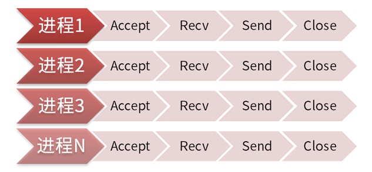
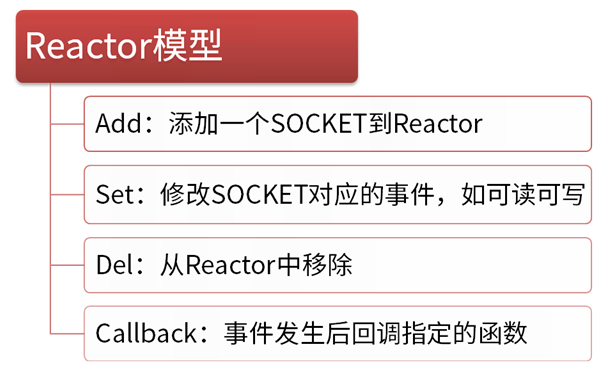
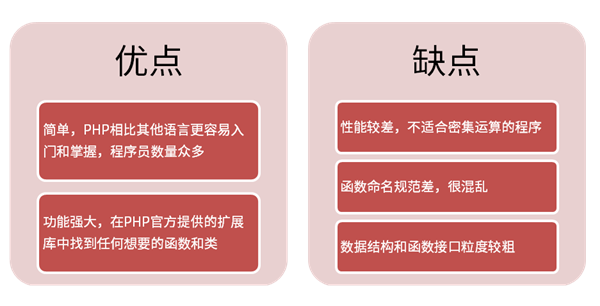
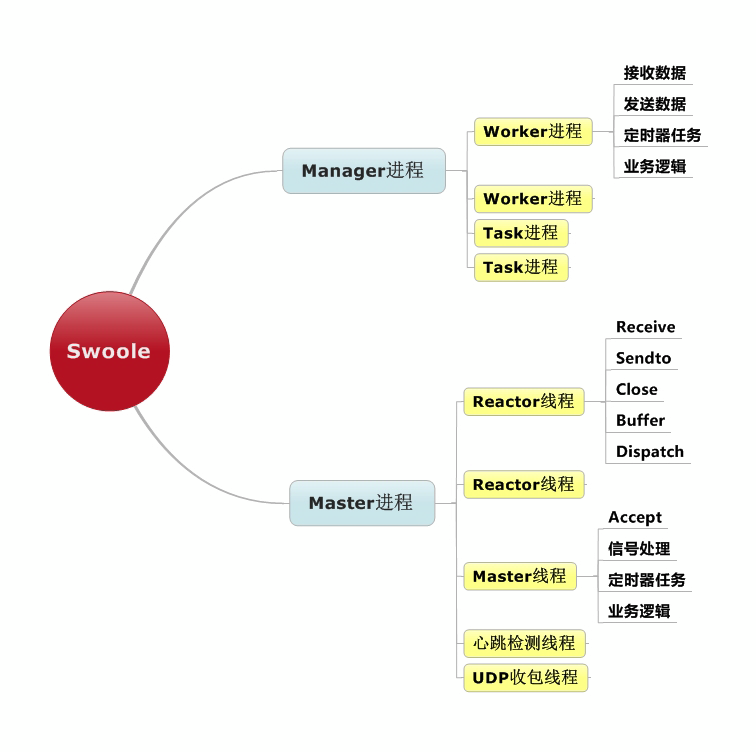
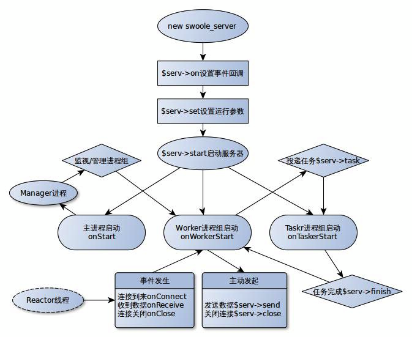

## PHP并发IO编程之路

*原文链接：[http://rango.swoole.com/archives/508](http://rango.swoole.com/archives/508)*

## 一、引言
并发IO问题一直是服务器端编程中的技术难题，从最早的同步阻塞直接Fork进程，到Worker进程池/线程池，到现在的异步IO、协程。PHP程序员因为有强大的LAMP框架，对这类底层方面的知识知之甚少，本文目的就是详细介绍PHP进行并发IO编程的各种尝试，最后再介绍Swoole的使用，深入浅出全面解析并发IO问题。

## 二、演进
### 1. 多进程/多线程同步阻塞
最早的服务器端程序都是通过多进程、多线程来解决并发IO的问题。进程模型出现的最早，从Unix系统诞生就开始有了进程的概念。最早的服务器端程序一般都是Accept一个客户端连接就创建一个进程，然后子进程进入循环同步阻塞地与客户端连接进行交互，收发处理数据。

多线程模式出现要晚一些，线程与进程相比更轻量，而且线程之间是共享内存堆栈的，所以不同的线程之间交互非常容易实现。比如聊天室这样的程序，客户端连接之间可以交互，比聊天室中的玩家可以任意的其他人发消息。用多线程模式实现非常简单，线程中可以直接向某一个客户端连接发送数据。而多进程模式就要用到管道、消息队列、共享内存，统称进程间通信（IPC）复杂的技术才能实现。
例子：

```php
<?php
$serv = stream_socket_server("tcp://0.0.0.0:8000",$errno,$errstr) or die("create server failed");

while (true) {
    $conn = @stream_socket_accept($serv,10);
    if ($conn){
        if (pcntl_fork() == 0) {
            $request = fread($conn,1000);
            echo $request,"\n";
            $response = "hello world";
            fwrite($conn,$response,strlen($response));
            fclose($conn);
            exit(0);
        }
    }else{
        echo "accept timeout \n";
    }
}
```
> 多进程/线程模型的流程是
>1. 创建一个 socket，绑定服务器端口（bind），监听端口（listen），在PHP中用stream_socket_server一个函数就能完成上面3个步骤，当然也可以使用更底层的sockets扩展分别实现。
>2. 进入while循环，阻塞在accept操作上，等待客户端连接进入。此时程序会进入随眠状态，直到有新的客户端发起connect到服务器，操作系统会唤醒此进程。accept函数返回客户端连接的socket
>3. 主进程在多进程模型下通过fork（php: pcntl_fork）创建子进程，多线程模型下使用pthread_create（php: new Thread）创建子线程。下文如无特殊声明将使用进程同时表示进程/线程。
>4. 子进程创建成功后进入while循环，阻塞在recv（php: fread）调用上，等待客户端向服务器发送数据。收到数据后服务器程序进行处理然后使用send（php: fwrite）向客户端发送响应。长连接的服务会持续与客户端交互，而短连接服务一般收到响应就会close。
>5. 当客户端连接关闭时，子进程退出并销毁所有资源。主进程会回收掉此子进程。

这种模式最大的问题是，进程/线程创建和销毁的开销很大。所以上面的模式没办法应用于非常繁忙的服务器程序。对应的改进版解决了此问题，这就是经典的Leader-Follower模型。

```php
<?php
$serv = stream_socket_server("tcp://0.0.0.0:8000",$errno,$errstr) or die("create server failed");

for($i=0; $i<32; $i++){
    if (pcntl_fork() == 0) {
        while (true){
            $conn = stream_socket_accept($serv);
            if (!$conn){
                continue;
            }
            $request = fread($conn,1024);
            echo $request,"\n";
            $response = "hello world";
            fwrite($conn,$response);
            fclose($conn);
        }
        exit(0);
    }
}
while (true){
    sleep(1);
}
```
它的特点是程序启动后就会创建N个进程。每个子进程进入Accept，等待新的连接进入。当客户端连接到服务器时，其中一个子进程会被唤醒，开始处理客户端请求，并且不再接受新的TCP连接。当此连接关闭时，子进程会释放，重新进入Accept，参与处理新的连接。

这个模型的优势是完全可以复用进程，没有额外消耗，性能非常好。很多常见的服务器程序都是基于此模型的，比如Apache、PHP-FPM。

多进程模型也有一些缺点。

1. 这种模型严重依赖进程的数量解决并发问题，一个客户端连接就需要占用一个进程，工作进程的数量有多少，并发处理能力就有多少。操作系统可以创建的进程数量是有限的。
启动大量进程会带来额外的进程调度消耗。数百个进程时可能进程上下文切换调度消耗占CPU不到1%可以忽略不接，如果启动数千甚至数万个进程，消耗就会直线上升。调度消耗可能占到CPU的百分之几十甚至100%。
另外有一些场景多进程模型无法解决，比如即时聊天程序（IM），一台服务器要同时维持上万甚至几十万上百万的连接（经典的C10K问题），多进程模型就力不从心了。

2. 还有一种场景也是多进程模型的软肋。通常Web服务器启动100个进程，如果一个请求消耗100ms，100个进程可以提供1000qps，这样的处理能力还是不错的。但是如果请求内要调用外网Http接口，像QQ、微博登录，耗时会很长，一个请求需要10s。那一个进程1秒只能处理0.1个请求，100个进程只能达到10qps，这样的处理能力就太差了。

有没有一种技术可以在一个进程内处理所有并发IO呢？答案是有，这就是IO复用技术。


### 2.IO复用/事件循环/异步非阻塞
其实IO复用的历史和多进程一样长，Linux很早就提供了select系统调用，可以在一个进程内维持1024个连接。后来又加入了poll系统调用，poll做了一些改进，解决了1024限制的问题，可以维持任意数量的连接。但select/poll还有一个问题就是，它需要循环检测连接是否有事件。这样问题就来了，如果服务器有100万个连接，在某一时间只有一个连接向服务器发送了数据，select/poll需要做循环100万次，其中只有1次是命中的，剩下的99万9999次都是无效的，白白浪费了CPU资源。

直到Linux 2.6内核提供了新的epoll系统调用，可以维持无限数量的连接，而且无需轮询，这才真正解决了C10K问题。现在各种高并发异步IO的服务器程序都是基于epoll实现的，比如Nginx、Node.js、Erlang、Golang。像Node.js这样单进程单线程的程序，都可以维持超过1百万TCP连接，全部归功于epoll技术。

IO复用异步非阻塞程序使用经典的Reactor模型，Reactor顾名思义就是反应堆的意思，它本身不处理任何数据收发。只是可以监视一个socket句柄的事件变化。



Reactor有4个核心的操作：
>1. add添加socket监听到reactor，可以是listen socket也可以使客户端socket，也可以是管道、eventfd、信号等。
>2. set修改事件监听，可以设置监听的类型，如可读、可写。可读很好理解，对于listen socket就是有新客户端连接到来了需要accept。对于客户端连接就是收到数据，需要recv。可写事件比较难理解一些。一个SOCKET是有缓存区的，如果要向客户端连接发送2M的数据，一次性是发不出去的，操作系统默认TCP缓存区只有256K。一次性只能发256K，缓存区满了之后send就会返回EAGAIN错误。这时候就要监听可写事件，在纯异步的编程中，必须去监听可写才能保证send操作是完全非阻塞的。
>3. del从reactor中移除，不再监听事件。
>4. callback就是事件发生后对应的处理逻辑，一般在add/set时制定。C语言用函数指针实现，JS可以用匿名函数，PHP可以用匿名函数、对象方法数组、字符串函数名。

Reactor只是一个事件发生器，实际对socket句柄的操作，如connect/accept、send/recv、close是在callback中完成的。具体编码可参考下面的`伪代码`：

```php
<?php
$reactor = new Reactor();
$svr_sock = stream_socket_server('tcp://127.0.0.0.1:8000');

$reactor->add($svr_sock,EV_READ,function() use ($svr_sock,$reactor){
    $cli_sock = stream_socket_accept($svr_sock);
    $reactor->add($cli_sock,EV_READ,function() use ($cli_sock,$reactor){
        $request = fread($cli_sock,8192);
        $reactor->add($cli_sock,EV_WRITE,function() use ($cli_sock,$request,$reactor){
            fwrite($cli_sock,"hello world\n");
            $reactor->del($cli_sock);
            fclose($cli_sock);
        });
    });
});
```
Reactor模型还可以与多进程、多线程结合起来用，既实现异步非阻塞IO，又利用到多核。目前流行的异步服务器程序都是这样的方式：如
+ Nginx：多进程Reactor
+ Nginx+Lua：多进程Reactor+协程
+ Golang：单线程Reactor+多线程协程
+ Swoole：多线程Reactor+多进程Worker

### 3.协程
协程从底层技术角度看实际上还是异步IO Reactor模型，应用层自行实现了任务调度，借助Reactor切换各个当前执行的用户态线程，但用户代码中完全感知不到Reactor的存在。

## 三、PHP并发IO编程实践

### 1.PHP相关扩展
+ Stream：PHP内核提供的socket封装
+ Sockets：对底层Socket API的封装
+ Libevent：对libevent库的封装
+ Event：基于Libevent更高级的封装，提供了面向对象接口、定时器、信号处理的支持
+ Pcntl/Posix：多进程、信号、进程管理的支持
+ Pthread：多线程、线程管理、锁的支持
+ PHP还有共享内存、信号量、消息队列的相关扩展
+ PECL：PHP的扩展库，包括系统底层、数据分析、算法、驱动、科学计算、图形等都有。如果PHP标准库中没有找到，可以在PECL寻找想要的功能。

### 2.PHP语言的优劣势


**PHP的优点：**
1. 第一个是简单，PHP比其他任何的语言都要简单，入门的话PHP真的是可以一周就入门。C++有一本书叫做《21天深入学习C++》，其实21天根本不可能学会，甚至可以说C++没有3-5年不可能深入掌握。但是PHP绝对可以7天入门。所以PHP程序员的数量非常多，招聘比其他语言更容易。
2. PHP的功能非常强大，因为PHP官方的标准库和扩展库里提供了做服务器编程能用到的99%的东西。PHP的PECL扩展库里你想要的任何的功能。
3. 另外PHP有超过20年的历史，生态圈是非常大的，在Github可以找到很多代码。

**PHP的缺点：**
1. 性能比较差，因为毕竟是动态脚本，不适合做密集运算，如果同样用PHP写再用c++写，PHP版本要比它差一百倍。
2. 函数命名规范差，这一点大家都是了解的，PHP更讲究实用性，没有一些规范。一些函数的命名是很混乱的，所以每次你必须去翻PHP的手册。
3. 提供的数据结构和函数的接口粒度比较粗。PHP只有一个Array数据结构，底层基于HashTable。PHP的Array集合了Map，Set，Vector，Queue，Stack，Heap等数据结构的功能。另外PHP有一个SPL提供了其他数据结构的类封装。
4. 对线程的支持较差。基本为不可用状态。
5. 对协程的支持，只有基础功能可用。没有一个较为完善的协程框架。腾讯的tsf协程框架开源程度不高。

**PHP应用方式**
+ PHP更适合偏实际应用层面的程序，业务开发、快速实现的利器
+ PHP不适合开发底层软件
+ 使用C/C++、JAVA、Golang等静态编译语言作为PHP的补充，动静结合
+ 借助IDE工具实现自动补全、语法提示  

### 3. PHP的Swoole扩展
基于上面的扩展使用纯PHP就可以完全实现异步网络服务器和客户端程序。但是想实现一个类似于多IO线程，还是有很多繁琐的编程工作要做，包括如何来管理连接，如何来保证数据的收发原则性，网络协议的处理。另外PHP代码在协议处理部分性能是比较差的，所以我启动了一个新的开源项目Swoole，使用C语言和PHP结合来完成了这项工作。灵活多变的业务模块使用PHP开发效率高，基础的底层和协议处理部分用C语言实现，保证了高性能。它以扩展的方式加载到了PHP中，提供了一个完整的网络通信的框架，然后PHP的代码去写一些业务。它的模型是基于多线程Reactor+多进程Worker，既支持全异步，也支持半异步半同步。

**Swoole的一些特点**
+ Accept线程，解决Accept性能瓶颈和惊群问题
+ 多IO线程，可以更好地利用多核
+ 提供了全异步和半同步半异步2种模式
+ 处理高并发IO的部分用异步模式
+ 复杂的业务逻辑部分用同步模式
+ 底层支持了遍历所有连接、互发数据、自动合并拆分数据包、数据发送原子性。

**Swoole的进程/线程模型**


**Swoole程序的执行流程**


## 四、使用PHP+Swoole扩展实现异步通信编程
实例代码在https://github.com/swoole/swoole-src 主页查看。

### 1.TCP服务器与客户端
**异步TCP服务器**

```php
<?php
$serv = new swoole_server("0.0.0.0",8000);

$serv->on('connect',function($serv,$fd){
    echo "Client:Connected.\n";
});

$serv->on('receive',function($serv,$fd, $from_id, $data){
    $serv->send($fd,'swoole: ',$data);
    $serv->close($fd);
});

$serv->on('close',function($serv,$fd){
    echo "Client:Closed.\n";
});

$serv->start();
```
在这里new swoole_server对象，然后参数传入监听的HOST和PORT，然后设置了3个回调函数，分别是onConnect有新的连接进入、onReceive收到了某一个客户端的数据、onClose某个客户端关闭了连接。最后调用start启动服务器程序。swoole底层会根据当前机器有多少CPU核数，启动对应数量的Reactor线程和Worker进程。

**异步客户端**

```php
<?php
$client = new swoole_client(SWOOLE_SOCK_TCP,SWOOLE_SOCK_ASYNC);

$client->on("connect",function($cli){
    $cli->send("hello world\n");
});

$client->on("receive",function($cli,$data){
    echo "Received: ".$data."\n";
});

$client->on("error",function($cli){
    echo "Connect failed\n";
});

$client->on("close",function($cli){
    echo "Connection close\n";
});

$client->connect('127.0.0.1',8000,0.5);
```

客户端的使用方法和服务器类似只是回调事件有4个，onConnect成功连接到服务器，这时可以去发送数据到服务器。onError连接服务器失败。onReceive服务器向客户端连接发送了数据。onClose连接关闭。

设置完事件回调后，发起connect到服务器，参数是服务器的IP,PORT和超时时间。

**同步客户端**

```php
<?php
$client = new swoole_client(SWOOLE_SOCK_TCP);
if (!$client->connect('127.0.0.1',8000,0.5)){
    die("connect failed.");
}

if (!$client->send("hello world")){
    die("send failed.");
}

$data = $client->recv();
if (!$data){
    die("recv failed.");
}

$client->close();
```
同步客户端不需要设置任何事件回调，它没有Reactor监听，是阻塞串行的。等待IO完成才会进入下一步。