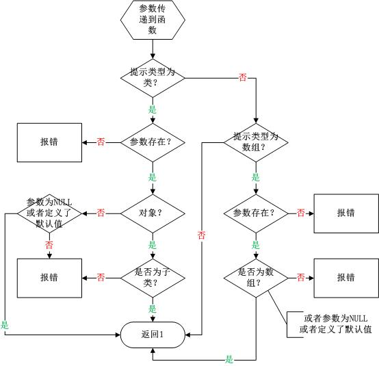

第五节 类型提示的实现

PHP是弱类型语言，向方法传递参数时候也并不严格检查数据类型。 不过有时需要判断传递到方法中的参数，为此PHP中提供了一些函数，来判断数据的类型。 比如is_numeric()，判断是否是一个数值或者可转换为数值的字符串，比如用于判断对象的类型运算符：instanceof。 instanceof 用来测定一个给定的对象是否来自指定的对象类。instanceof 运算符是 PHP 5 引进的。 在此之前是使用的is_a()，不过现在已经不推荐使用。

为了避免对象类型不规范引起的问题，PHP5中引入了类型提示这个概念。在定义方法参数时，同时定义参数的对象类型。 如果在调用的时候，传入参数的类型与定义的参数类型不符，则会报错。这样就可以过滤对象的类型，或者说保证了数据的安全性。

PHP中的类型提示功能只能用于参数为对象的提示，而无法用于为整数，字串，浮点等类型提示。在PHP5.1之后，PHP支持对数组的类型提示。

要使用类型提示，只要在方法（或函数）的对象型参数前加一个已存在的类的名称，当使用类型提示时， 你不仅可以指定对象类型，还可以指定抽象类和接口。

一个数组的类型提示示例：

    function array_print(Array $arr) {
        print_r($arr);
    }
     
    array_print(1);
以上的这段代码有一点问题，它触发了我们这次所介绍的类型提示，这段代码在PHP5.1之后的版本执行，会报错如下：

    Catchable fatal error: Argument 1 passed to array_print() must be an array, 
    integer given, called in  ...
当我们把函数参数中的整形变量变为数组时，程序会正常运行，调用print_r函数输出数组。 那么这个类型提示是如何实现的呢？ 不管是在类中的方法，还是我们调用的函数，都是使用function关键字作为其声明的标记， 而类型提示的实现是与函数的声明相关的，在声明时就已经确定了参数的类型是哪些，但是需要在调用时才会显示出来。 这里，我们从两个方面说明类型提示的实现：

参数声明时的类型提示
函数或方法调用时的类型提示
将刚才的那个例子修改一下：

    function array_print(Array $arr = 1) {
        print_r($arr);
    }
     
    array_print(array(1));
这段代码与前面的那个示例相比，函数的参数设置了一个默认值，但是这个默认值是一个整形变量， 它与参数给定的类型提示Array不一样，因此，当我们运行这段代码时会很快看到程序会报错如下：

    Fatal error: Default value for parameters with array type hint 
    can only be an array or NULL
为什么为很快看到报错呢？ 因为默认值的检测过程发生在中间代码生成阶段，与运行时的报错不同，它还没有生成中间代码，也没有执行中间代码的过程。 在Zend/zend_language_parser.y文件中，我们找到函数的参数列表在编译时都会调用zend_do_receive_arg函数。 而在这个函数的参数列表中，第5个参数（ znode *class_type）与我们这节所要表述的类型提示密切相关。 这个参数的作用是声明类型提示中的类型，这里的类型有三种：

空，即没有类型提示
类名，用户定义或PHP自定义的类、接口等
数组，编译期间对应的token是T_ARRAY，即Array字符串
在zend_do_receive_arg函数中，针对class_type参数做了一系列的操作，基本上是针对上面列出的三种类型， 其中对于类名，程序并没有判断这个类是否存在，即使你使用了一个不存在的类名， 程序在报错时，显示的也会是实参所给的对象并不是给定类的实例。

以上是声明类型提示的过程以及在声明过程中对参数默认值的判断过程，下面我们看下在函数或方法调用时类型提示的实现。

从上面的声明过程我们知道PHP在编译类型提示的相关代码时调用的是Zend/zend_complie.c文件中的zend_do_receive_arg函数， 在这个函数中将类型提示的判断的opcode被赋值为ZEND_RECV。根据opcode的映射计算规则得出其在执行时调用的是ZEND_RECV_SPEC_HANDLER。 其代码如下：

    static int ZEND_FASTCALL  ZEND_RECV_SPEC_HANDLER(ZEND_OPCODE_HANDLER_ARGS)
    {
           ...//省略
            if (param == NULL) {
                    char *space;
                    char *class_name = get_active_class_name(&space TSRMLS_CC);
                    zend_execute_data *ptr = EX(prev_execute_data);
     
                    if (zend_verify_arg_type((zend_function *) EG(active_op_array), arg_num, NULL, opline->extended_value TSRMLS_CC)) {
                           ...//省略
                    }
                   ...//省略
            } else {
                  ...//省略
                    zend_verify_arg_type((zend_function *) EG(active_op_array), arg_num, *param, opline->extended_value TSRMLS_CC);
                  ...//省略
            }
          ...//省略
    }
如上所示：在ZEND_RECV_SPEC_HANDLER中最后调用的是zend_verify_arg_type。其代码如下：

    static inline int zend_verify_arg_type(zend_function *zf, zend_uint arg_num, zval *arg, ulong fetch_type TSRMLS_DC)
    {
       ...//省略
     
        if (cur_arg_info->class_name) {
            const char *class_name;
     
            if (!arg) {
                need_msg = zend_verify_arg_class_kind(cur_arg_info, fetch_type, &class_name, &ce TSRMLS_CC);
                return zend_verify_arg_error(zf, arg_num, cur_arg_info, need_msg, class_name, "none", "" TSRMLS_CC);
            }
            if (Z_TYPE_P(arg) == IS_OBJECT) { // 既然是类对象参数, 传递的参数需要是对象类型
                // 下面检查这个对象是否是参数提示类的实例对象, 这里是允许传递子类实例对象
                need_msg = zend_verify_arg_class_kind(cur_arg_info, fetch_type, &class_name, &ce TSRMLS_CC);
                if (!ce || !instanceof_function(Z_OBJCE_P(arg), ce TSRMLS_CC)) {
                    return zend_verify_arg_error(zf, arg_num, cur_arg_info, need_msg, class_name, "instance of ", Z_OBJCE_P(arg)->name TSRMLS_CC);
                }
            } else if (Z_TYPE_P(arg) != IS_NULL || !cur_arg_info->allow_null) { // 参数为NULL, 也是可以通过检查的,
                 // 如果函数定义了参数默认值, 不传递参数调用也是可以通过检查的
                need_msg = zend_verify_arg_class_kind(cur_arg_info, fetch_type, &class_name, &ce TSRMLS_CC);
                return zend_verify_arg_error(zf, arg_num, cur_arg_info, need_msg, class_name, zend_zval_type_name(arg), "" TSRMLS_CC);
            }
        } else if (cur_arg_info->array_type_hint) { //  数组
            if (!arg) {
                return zend_verify_arg_error(zf, arg_num, cur_arg_info, "be an array", "", "none", "" TSRMLS_CC);
            }
            if (Z_TYPE_P(arg) != IS_ARRAY && (Z_TYPE_P(arg) != IS_NULL || !cur_arg_info->allow_null)) {
                return zend_verify_arg_error(zf, arg_num, cur_arg_info, "be an array", "", zend_zval_type_name(arg), "" TSRMLS_CC);
            }
        }
        return 1;
    }
zend_verify_arg_type的整个流程如图3.1所示：

图3.1 类型提示判断流程图
如果类型提示报错，zend_verify_arg_type函数最后都会调用 zend_verify_arg_class_kind 生成报错信息， 并且调用 zend_verify_arg_error 报错。如下所示代码：

    static inline char * zend_verify_arg_class_kind(const zend_arg_info *cur_arg_info, ulong fetch_type, const char **class_name, zend_class_entry **pce TSRMLS_DC)
    {
        *pce = zend_fetch_class(cur_arg_info->class_name, cur_arg_info->class_name_len, (fetch_type | ZEND_FETCH_CLASS_AUTO | ZEND_FETCH_CLASS_NO_AUTOLOAD) TSRMLS_CC);
     
        *class_name = (*pce) ? (*pce)->name: cur_arg_info->class_name;
        if (*pce && (*pce)->ce_flags & ZEND_ACC_INTERFACE) {
            return "implement interface ";
        } else {
            return "be an instance of ";
        }
    }
     
     
    static inline int zend_verify_arg_error(const zend_function *zf, zend_uint arg_num, const zend_arg_info *cur_arg_info, const char *need_msg, const char *need_kind, const char *given_msg, char *given_kind TSRMLS_DC)
    {
        zend_execute_data *ptr = EG(current_execute_data)->prev_execute_data;
        char *fname = zf->common.function_name;
        char *fsep;
        char *fclass;
     
        if (zf->common.scope) {
            fsep =  "::";
            fclass = zf->common.scope->name;
        } else {
            fsep =  "";
            fclass = "";
        }
     
        if (ptr && ptr->op_array) {
            zend_error(E_RECOVERABLE_ERROR, "Argument %d passed to %s%s%s() must %s%s, %s%s given, called in %s on line %d and defined", arg_num, fclass, fsep, fname, need_msg, need_kind, given_msg, given_kind, ptr->op_array->filename, ptr->opline->lineno);
        } else {
            zend_error(E_RECOVERABLE_ERROR, "Argument %d passed to %s%s%s() must %s%s, %s%s given", arg_num, fclass, fsep, fname, need_msg, need_kind, given_msg, given_kind);
        }
        return 0;
    }
在上面的代码中，我们可以找到前面的报错信息中的一些关键字Argument、 passed to、called in等。 这就是我们在调用函数或方法时类型提示显示错误信息的最终执行位置。